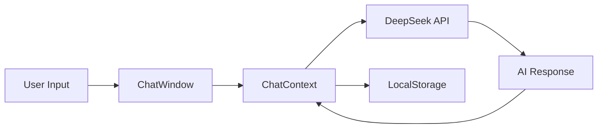

# Chat Buddy Remake

<div align="center">


**AI Chat Companion | AI 聊天伴侣**

A modern, responsive AI chat application featuring multiple personalities, anime characters, group chats, and bilingual support.

一个现代化的响应式AI聊天应用，支持多种个性角色、二次元角色、群聊和双语切换。

[English](#features) | [中文](#功能特性)

</div>

---

## Table of Contents / 目录

- [Features](#features) / [功能特性](#功能特性)
- [Demo](#demo) / [演示](#演示)
- [Getting Started](#getting-started) / [快速开始](#快速开始)
- [Usage Guide](#usage-guide) / [使用指南](#使用指南)
- [Architecture](#architecture) / [技术架构](#技术架构)
- [Contributing](#contributing) / [贡献指南](#贡献指南)
- [Changelog](#changelog) / [变更日志](#变更日志)

---

## Features

### 🤖 AI Friend System
- **13 Unique AI Personas**: 5 original characters + 8 anime characters
- Each persona has distinct personality traits, speaking styles, and interests
- Powered by DeepSeek API for intelligent, context-aware responses

### 🎌 Anime Characters
Meet your favorite anime characters:
- **Hatsune Miku** - Cheerful virtual idol
- **Rem** - Devoted maid from Re:Zero
- **Rin Tohsaka** - Tsundere magus from Fate
- **Naruto Uzumaki** - Determined ninja
- **L** - Genius detective from Death Note
- **Zero Two** - Mysterious darling
- **Asuna** - Brave swordswoman from SAO
- **Gojo Satoru** - The strongest from Jujutsu Kaisen

### 💬 Group Chat
- Create groups with multiple AIs
- AIs interact with you and each other
- Customize AI capabilities per group

### 🌍 Bilingual Support
- Seamless English/Chinese interface switching
- All UI elements, documentation, and AI responses support both languages

### 🎨 Modern UI
- "Macaroon Orange" theme with WeChat-inspired design
- Smooth animations and responsive layout
- Works on desktop and mobile

### 💾 Local Storage
- Chats and settings saved in browser
- No account required
- Privacy-focused design

### 🤖 Smart AI Features (v0.2.1)
- Multi-message: AI can send consecutive messages like real users
- Typing indicators: See when AI is "typing"
- Proactive messaging: AI may reach out on their own
- WeChat-style time display

---

## 功能特性

### 🤖 AI好友系统
- **13位独特AI角色**：5位原创角色 + 8位二次元角色
- 每个角色拥有独特的性格、说话风格和兴趣爱好
- 基于DeepSeek API提供智能上下文感知回复

### 🎌 二次元角色
与你喜爱的动漫角色对话：
- **初音未来** - 活泼的虚拟偶像
- **雷姆** - Re:Zero中忠诚的女仆
- **远坂凛** - Fate系列的傲娇魔术师
- **漩涡鸣人** - 永不放弃的忍者
- **L** - 死亡笔记中的天才侦探
- **零二** - 神秘的Darling
- **亚丝娜** - 刀剑神域的勇敢剑士
- **五条悟** - 咒术回战中最强的男人

### 💬 群聊功能
- 创建包含多个AI的群组
- AI不仅与你互动，彼此之间也会交流
- 可为每个群组自定义AI能力

### 🌍 双语支持
- 中英文界面无缝切换
- 所有UI元素、文档和AI回复都支持双语

### 🎨 现代UI设计
- "马卡龙橙"主题，微信风格设计
- 流畅的动画和响应式布局
- 支持桌面和移动设备

### 💾 本地存储
- 聊天记录和设置保存在浏览器中
- 无需账号
- 注重隐私保护

### 🤖 智能AI功能 (v0.2.1)
- 多条消息：AI可以像真人一样连续发送消息
- 输入指示器：显示AI正在"输入中"
- 主动消息：AI可能会主动联系你
- 微信风格时间显示

---

## Demo


---

## Getting Started

### Prerequisites / 前置要求

| Requirement | Version | 说明 |
|-------------|---------|------|
| Node.js | v16+ | JavaScript运行环境 |
| npm | v7+ | 包管理器 |
| DeepSeek API Key | - | 可选，用于AI智能回复 |

### Installation / 安装步骤

```bash
# 1. Clone the repository / 克隆仓库
git clone https://github.com/Luckycat133/Chat_Buddy.git
cd Chat_Buddy

# 2. Install dependencies / 安装依赖
npm install

# 3. Configure environment / 配置环境变量
# Copy .env.example to .env and edit / 复制.env.example为.env并编辑
cp .env.example .env
# Edit .env with your API settings / 编辑.env配置你的API设置

# 4. Start development server / 启动开发服务器
npm run dev
```

### Environment Variables / 环境变量

| Variable | Required | Description / 说明 |
|----------|----------|-------------|
| `VITE_AI_API_URL` | Yes | API Base URL (e.g., `https://api.deepseek.com`) |
| `VITE_AI_API_KEY` | Yes | Your API key for AI responses |
| `VITE_AI_MODEL` | Yes | Model name (e.g., `deepseek-chat`, `sonar`) |

> **Supported Providers / 支持的API提供商**: DeepSeek, Perplexity, OpenAI, and other OpenAI-compatible APIs.

---

## Usage Guide

### Creating a Chat / 创建聊天

1. Click the **"+"** button or navigate to "New Chat"
2. Select one or more AI friends
3. For group chats, optionally set a group name
4. Click "Create Chat" to start

### Chatting / 聊天

1. Type your message in the input field
2. Press Enter or click Send
3. AIs will respond based on their personality and context
4. In groups, AIs may also respond to each other

### Settings / 设置

- **Language**: Switch between English and Chinese
- **Theme**: Macaroon Orange (default)
- **Help**: View FAQ and usage tips
- **About**: Check version and changelog

---

## 使用指南

### 创建聊天

1. 点击 **"+"** 按钮或导航到"新建聊天"
2. 选择一个或多个AI好友
3. 群聊时可设置群名称
4. 点击"创建聊天"开始

### 聊天

1. 在输入框中输入消息
2. 按回车或点击发送
3. AI会根据其性格和上下文回复
4. 在群聊中，AI之间也可能互相交流

### 设置

- **语言**：切换中英文
- **主题**：马卡龙橙（默认）
- **帮助**：查看FAQ和使用技巧
- **关于**：查看版本和变更日志

---

## Architecture

### Tech Stack / 技术栈

```
├── Frontend Framework: React 18+
├── Build Tool: Vite
├── Styling: TailwindCSS + Vanilla CSS
├── State Management: React Context API
├── AI Backend: DeepSeek API
└── Storage: LocalStorage
```

### Project Structure / 项目结构

```
Chat_Buddy_Remake/
├── public/
│   └── avatars/          # AI character avatars
├── src/
│   ├── components/       # Reusable UI components
│   ├── context/          # React Context providers
│   ├── data/             # Static data (personas, locales)
│   ├── hooks/            # Custom React hooks
│   ├── pages/            # Page components
│   ├── styles/           # CSS files
│   └── utils/            # Utility functions
├── .env                  # Environment variables
├── CHANGELOG.md          # Version history
└── README.md             # This file
```

### Data Flow / 数据流



---

## Contributing

We welcome contributions! Please follow these guidelines:

### How to Contribute / 如何贡献

1. **Fork** the repository
2. Create a **feature branch**: `git checkout -b feature/amazing-feature`
3. **Commit** your changes: `git commit -m 'Add amazing feature'`
4. **Push** to the branch: `git push origin feature/amazing-feature`
5. Open a **Pull Request**

### Code Style / 代码规范

- Use ESLint for JavaScript/JSX linting
- Follow React best practices
- Write meaningful commit messages
- Add bilingual support for new UI text

### Reporting Issues / 报告问题

- Use GitHub Issues
- Include steps to reproduce
- Provide browser and OS information

---

## Changelog

See [CHANGELOG.md](CHANGELOG.md) for version history.

**Current Version**: v0.2.2 (2025-12-20)

### Recent Updates / 最近更新
- 😊 Emoji picker with 8 categories / 8分类表情选择器
- 💬 Message context menu (copy, quote, delete) / 消息右键菜单
- 📁 File upload and AI file generation / 文件上传与AI生成
- 🔍 RAG (Retrieval Augmented Generation) / RAG检索增强
- ✨ AI multi-message capability / AI连续消息功能
- ⌨️ Typing indicators / 输入中指示器

---

## License

MIT License - see [LICENSE](LICENSE) for details.

---

<div align="center">

**Made with ❤️ for anime fans and AI enthusiasts**

[⬆ Back to Top](#chat-buddy-remake)

</div>
