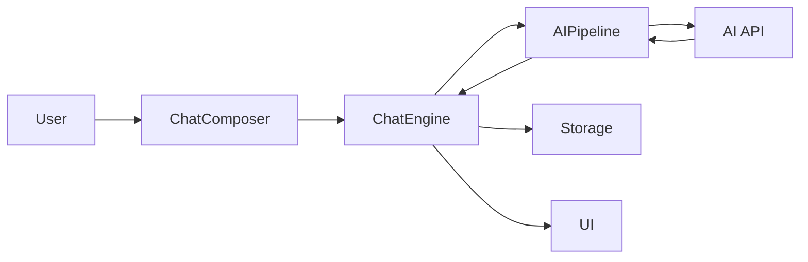

# Chat Buddy Web

> **Status: Maintenance Mode**
>
> This web version receives critical fixes and migration work only. New product
> development is moving to [Chat_Buddy_iOS](https://github.com/Luckycat133/Chat_Buddy_iOS).
> Before moving devices or testing the iOS importer, export a JSON backup from
> Settings. See [WEB_TO_IOS_MIGRATION.md](WEB_TO_IOS_MIGRATION.md).
>
> **API-key warning:** this is a browser application. Any `VITE_*_API_KEY`
> supplied at build time is embedded in the public JavaScript bundle. Public
> deployments must use a server-side proxy or require each user to enter their own
> key at runtime.
>
> **Latest review:** the security, data-integrity, CI, and UI/UX remediation was
> verified through a real OpenRouter Agent/persona conversation on 2026-08-13 in the [comprehensive review](docs/CODE_REVIEW_REPORT_2026-08-11.md).


<div align="center">


**AI Chat Companion**

A modern, responsive AI chat application featuring multiple personalities, anime characters, group chats, and bilingual support.

[English](README.md) | [中文](README.zh-CN.md)

</div>

---

## Table of Contents

- [Features](#features)
- [Demo](#demo)
- [Getting Started](#getting-started)
- [Usage Guide](#usage-guide)
- [Architecture](#architecture)
- [Contributing](#contributing)
- [Changelog](#changelog)

---

## Features

### 🤖 AI Friend System
- **13 Unique AI Personas**: 5 original characters + 8 anime characters
- Each persona has distinct personality traits, speaking styles, and interests
- Works with OpenRouter, DeepSeek, OpenAI, and other OpenAI-compatible APIs

### 🎌 Anime Characters
Meet your favorite anime characters:
- **Hatsune Miku** - Cheerful virtual idol
- **Rem** - Devoted maid from Re:Zero
- **Rin Tohsaka** - Tsundere magus from Fate
- **Naruto Uzumaki** - Determined ninja
- **L** - Genius detective from Death Note
- **Zero Two** - Mysterious darling
- **Asuna** - Brave swordswoman from SAO
- **Gojo Satoru** - The strongest from Jujutsu Kaisen

### 💬 Group Chat
- Create groups with multiple AIs
- AIs interact with you and each other
- Customize AI capabilities per group

### 🌍 Bilingual Support
- Seamless English/Chinese interface switching
- All UI elements, documentation, and AI responses support both languages

### 🎨 Modern UI
- "Macaroon Orange" theme with WeChat-inspired design
- Smooth animations and responsive layout
- Works on desktop and mobile

### 💾 Local Storage
- Chats and settings saved in browser
- No account required
- Privacy-focused design

### 🤖 Smart AI Features (v0.2.1)
- Multi-message: AI can send consecutive messages like real users
- Typing indicators: See when AI is "typing"
- Proactive messaging: AI may reach out on their own
- WeChat-style time display

### 📸 Moments Enhancements (v0.2.4)
- **AI Dynamic Posts**: AI friends post daily life updates based on their location and personality
- **Smart Interactions**: AI intelligently comments on and likes your posts
- **WeChat-style Features**: Location tags, privacy settings, and cover photos
- **Emoji Reactions**: React to posts with 😂❤️👍🔥😮😢

---

## Getting Started

### Prerequisites

| Requirement | Version |
|-------------|---------|
| Node.js | `^20.19.0`, `^22.13.0`, or `>=24.0.0` |
| npm | v7+ |
| DeepSeek API Key | Optional, for AI responses |

### Installation

```bash
# 1. Clone the repository
git clone https://github.com/Luckycat133/Chat_Buddy.git
cd Chat_Buddy

# 2. Install dependencies
npm install

# 3. Configure environment
# Copy .env.example to .env and edit
cp .env.example .env
# Edit .env with your API settings

# 4. Start development server
npm run dev
```

### Environment Variables

| Variable | Required | Description |
|----------|----------|-------------|
| `VITE_AI_API_URL` | Yes | API Base URL (e.g., `https://api.deepseek.com`) |
| `VITE_AI_API_KEY` | Yes | Your API key for AI responses |
| `VITE_AI_MODEL` | Yes | Model name (default: `nvidia/nemotron-3-ultra-550b-a55b:free`) |

> **Provider setup**: the default preset uses OpenRouter with one fixed free model. Other OpenAI-compatible endpoints can be configured manually. Runtime keys entered in Settings live in `sessionStorage` only; build-time `VITE_*` secrets are still embedded in the client bundle, so production deployments should use a server-side proxy.

---

## Usage Guide

### Creating a Chat

1. Click the **"+"** button or navigate to "New Chat"
2. Select one or more AI friends
3. For group chats, optionally set a group name
4. Click "Create Chat" to start

### Chatting

1. Type your message in the input field
2. Press Enter or click Send
3. AIs will respond based on their personality and context
4. In a group, one eligible AI responds to each user turn to avoid model fan-out

### Request Budget

- A normal persona or Agent reply uses one request to the configured text model. There are no automatic model fallbacks or hidden retries.
- Explicit tools are precomputed when their arguments are unambiguous. If the model must infer tool arguments, the visible function-calling flow may use two text-model requests: choose the tool, then explain the verified result.
- Conversation titles, durable-memory capture, Moments background activity, quizzes, idiom games, palettes, and deterministic math run locally with zero model requests. Up to eight independently extracted durable facts are injected when relevant instead of replaying an extra model-generated summary.
- An explicit Scholar search uses one Tavily retrieval plus one text-model synthesis. Explicit image generation uses one MiniMax image request and no text-model request.
- Text-to-speech runs only after the user clicks Read Aloud; the generated audio is cached for repeat playback.
- Provider errors remain visible with a manual Retry action instead of spending another request automatically.
- Request efficiency never comes from discarding the user's task: the latest input is preserved, up to 48 recent messages / 100,000 characters are available, and output ceilings range from 1,600 to 6,144 tokens according to the task.
- `npm run prompt:bench` guards those capability contracts. The current specialist prompts intentionally use about 146 more estimated tokens (+11.5%) for stronger Coder/Sensei instructions; savings come from request fan-out and irrelevant per-turn sections, not from weakening the answer.
- Task Agents and personas stream answers into one in-place message. Requests to the fixed Nemotron model use OpenRouter `reasoning.effort: "none"` with reasoning excluded because live validation showed optional extended reasoning could consume the completion budget; normal inference and function calling remain enabled.
- If an upstream response reaches its length limit, the completed text stays visible with an explicit truncation notice. For math tools, the exact local result and symbolic form remain authoritative even when provider synthesis is unusable. The app never spends a hidden retry.

### Settings

- **Language**: Switch between English and Chinese
- **Theme**: Macaroon Orange (default)
- **Help**: View FAQ and usage tips
- **About**: Check version and changelog

---

## Architecture

> See [docs/ARCHITECTURE.md](docs/ARCHITECTURE.md) for details.

### Tech Stack

- Frontend: React 19, Vite
- Styling: TailwindCSS
- State: Clean Architecture (ChatEngine + Context)
- AI: one configured OpenRouter/OpenAI-compatible text model; Tavily and MiniMax only for explicit search/media actions
- Storage: LocalStorage (settings) + IndexedDB (chats, documents, and media)

### Project Structure

```
src/
├── core/               # Domain logic (pure JS)
│   └── chat/
├── services/           # Infrastructure (API, Storage)
├── features/           # Feature modules
│   ├── chat/
│   └── moments/
├── providers/          # Context composition
├── components/         # Shared UI
└── pages/              # Routes
```

### Data Flow



---

## Contributing

We welcome contributions! Please follow these guidelines:

### How to Contribute

1. **Fork** the repository
2. Create a **feature branch**: `git checkout -b feature/amazing-feature`
3. **Commit** your changes: `git commit -m 'Add amazing feature'`
4. **Push** to the branch: `git push origin feature/amazing-feature`
5. Open a **Pull Request**

### Code Style

- Use ESLint for JavaScript/JSX linting
- Follow React best practices
- Write meaningful commit messages
- Add bilingual support for new UI text

### Reporting Issues

- Use GitHub Issues
- Include steps to reproduce
- Provide browser and OS information

---

## Changelog

See [CHANGELOG.md](CHANGELOG.md) for version history.

**Current Web Version**: v0.4.1

### Recent Updates
- 🖼️ **Immersive Background System**: 20+ AI-generated backgrounds for each persona
- 🌙 **Dark Mode Overhaul**: Complete CSS variable system with glass effects
- 📱 **iOS 26 Style**: Refined border-radius and subtle animations
- 🎨 **Per-Chat Backgrounds**: Custom background for each conversation
- 🧠 **Specialized AI Agents**: 6 task-focused assistants (Coder, Muse, Scholar, etc.)
- 🛡️ **Authorized Tool Calling**: deny-by-default persona tool allowlists; arbitrary browser code execution is disabled
- 📸 Enhanced AI Moments with dynamic posting and smart comments
- 📍 Location tags and visibility settings (Public/Private/etc.)
- 💬 Reply threads and emoji reactions in Moments
- 👥 Moments/Timeline with AI auto-posting
- 👫 Friends management with groups
- 🎯 Daily Check-in and Achievements
- 🧧 Red Packet and Gift system
- 🎮 Rock-Paper-Scissors mini game
- 😊 Emoji picker with 8 categories

---

## License

MIT License - see [LICENSE](LICENSE) for details.

---

<div align="center">

**Made with ❤️ for anime fans and AI enthusiasts**

[⬆ Back to Top](#chat-buddy-remake)

</div>
