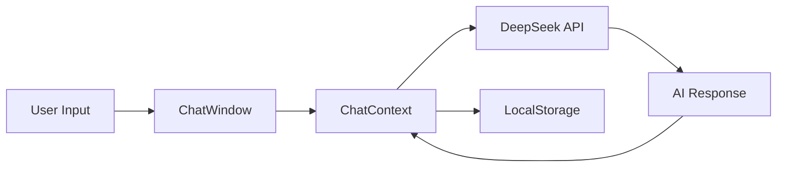

# Chat Buddy Remake

<div align="center">


**AI Chat Companion**

A modern, responsive AI chat application featuring multiple personalities, anime characters, group chats, and bilingual support.

[English](README.md) | [中文](README.zh-CN.md)

</div>

---

## Table of Contents

- [Features](#features)
- [Demo](#demo)
- [Getting Started](#getting-started)
- [Usage Guide](#usage-guide)
- [Architecture](#architecture)
- [Contributing](#contributing)
- [Changelog](#changelog)

---

## Features

### 🤖 AI Friend System
- **13 Unique AI Personas**: 5 original characters + 8 anime characters
- Each persona has distinct personality traits, speaking styles, and interests
- Powered by DeepSeek API for intelligent, context-aware responses

### 🎌 Anime Characters
Meet your favorite anime characters:
- **Hatsune Miku** - Cheerful virtual idol
- **Rem** - Devoted maid from Re:Zero
- **Rin Tohsaka** - Tsundere magus from Fate
- **Naruto Uzumaki** - Determined ninja
- **L** - Genius detective from Death Note
- **Zero Two** - Mysterious darling
- **Asuna** - Brave swordswoman from SAO
- **Gojo Satoru** - The strongest from Jujutsu Kaisen

### 💬 Group Chat
- Create groups with multiple AIs
- AIs interact with you and each other
- Customize AI capabilities per group

### 🌍 Bilingual Support
- Seamless English/Chinese interface switching
- All UI elements, documentation, and AI responses support both languages

### 🎨 Modern UI
- "Macaroon Orange" theme with WeChat-inspired design
- Smooth animations and responsive layout
- Works on desktop and mobile

### 💾 Local Storage
- Chats and settings saved in browser
- No account required
- Privacy-focused design

### 🤖 Smart AI Features (v0.2.1)
- Multi-message: AI can send consecutive messages like real users
- Typing indicators: See when AI is "typing"
- Proactive messaging: AI may reach out on their own
- WeChat-style time display

---

## Demo


---

## Getting Started

### Prerequisites

| Requirement | Version |
|-------------|---------|
| Node.js | v16+ |
| npm | v7+ |
| DeepSeek API Key | Optional, for AI responses |

### Installation

```bash
# 1. Clone the repository
git clone https://github.com/Luckycat133/Chat_Buddy.git
cd Chat_Buddy

# 2. Install dependencies
npm install

# 3. Configure environment
# Copy .env.example to .env and edit
cp .env.example .env
# Edit .env with your API settings

# 4. Start development server
npm run dev
```

### Environment Variables

| Variable | Required | Description |
|----------|----------|-------------|
| `VITE_AI_API_URL` | Yes | API Base URL (e.g., `https://api.deepseek.com`) |
| `VITE_AI_API_KEY` | Yes | Your API key for AI responses |
| `VITE_AI_MODEL` | Yes | Model name (e.g., `deepseek-chat`, `sonar`) |

> **Supported Providers**: DeepSeek, Perplexity, OpenAI, and other OpenAI-compatible APIs.

---

## Usage Guide

### Creating a Chat

1. Click the **"+"** button or navigate to "New Chat"
2. Select one or more AI friends
3. For group chats, optionally set a group name
4. Click "Create Chat" to start

### Chatting

1. Type your message in the input field
2. Press Enter or click Send
3. AIs will respond based on their personality and context
4. In groups, AIs may also respond to each other

### Settings

- **Language**: Switch between English and Chinese
- **Theme**: Macaroon Orange (default)
- **Help**: View FAQ and usage tips
- **About**: Check version and changelog

---

## Architecture

### Tech Stack

```
├── Frontend Framework: React 18+
├── Build Tool: Vite
├── Styling: TailwindCSS + Vanilla CSS
├── State Management: React Context API
├── AI Backend: DeepSeek API
└── Storage: LocalStorage
```

### Project Structure

```
Chat_Buddy_Remake/
├── public/
│   └── avatars/          # AI character avatars
├── src/
│   ├── components/       # Reusable UI components
│   ├── context/          # React Context providers
│   ├── data/             # Static data (personas, locales)
│   ├── hooks/            # Custom React hooks
│   ├── pages/            # Page components
│   ├── styles/           # CSS files
│   └── utils/            # Utility functions
├── .env                  # Environment variables
├── CHANGELOG.md          # Version history
└── README.md             # This file
```

### Data Flow



---

## Contributing

We welcome contributions! Please follow these guidelines:

### How to Contribute

1. **Fork** the repository
2. Create a **feature branch**: `git checkout -b feature/amazing-feature`
3. **Commit** your changes: `git commit -m 'Add amazing feature'`
4. **Push** to the branch: `git push origin feature/amazing-feature`
5. Open a **Pull Request**

### Code Style

- Use ESLint for JavaScript/JSX linting
- Follow React best practices
- Write meaningful commit messages
- Add bilingual support for new UI text

### Reporting Issues

- Use GitHub Issues
- Include steps to reproduce
- Provide browser and OS information

---

## Changelog

See [CHANGELOG.md](CHANGELOG.md) for version history.

**Current Version**: v0.2.3 (2025-12-20)

### Recent Updates
- 👥 Moments/Timeline with AI auto-posting
- 👫 Friends management with groups
- 🎯 Daily Check-in and Achievements
- 🧧 Red Packet and Gift system
- 🎮 Rock-Paper-Scissors mini game
- 🌙 Dark mode and theme settings
- 🔔 Notification settings
- 😊 Emoji picker with 8 categories

---

## License

MIT License - see [LICENSE](LICENSE) for details.

---

<div align="center">

**Made with ❤️ for anime fans and AI enthusiasts**

[⬆ Back to Top](#chat-buddy-remake)

</div>
