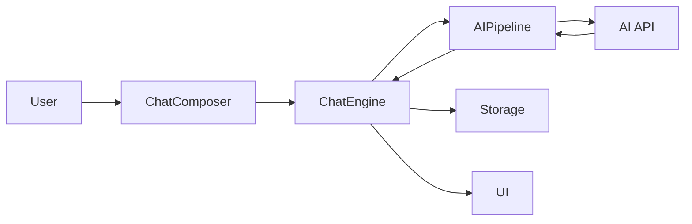

# Chat Buddy Remake

<div align="center">


**AI Chat Companion**

A modern, responsive AI chat application featuring multiple personalities, anime characters, group chats, and bilingual support.

[English](README.md) | [中文](README.zh-CN.md)

</div>

---

## Table of Contents

- [Features](#features)
- [Demo](#demo)
- [Getting Started](#getting-started)
- [Usage Guide](#usage-guide)
- [Architecture](#architecture)
- [Contributing](#contributing)
- [Changelog](#changelog)

---

## Features

### 🤖 AI Friend System

- **13 Unique AI Personas**: 5 original characters + 8 anime characters
- Each persona has distinct personality traits, speaking styles, and interests
- Powered by DeepSeek API for intelligent, context-aware responses

### 🎌 Anime Characters

Meet your favorite anime characters:

- **Hatsune Miku** - Cheerful virtual idol
- **Rem** - Devoted maid from Re:Zero
- **Rin Tohsaka** - Tsundere magus from Fate
- **Naruto Uzumaki** - Determined ninja
- **L** - Genius detective from Death Note
- **Zero Two** - Mysterious darling
- **Asuna** - Brave swordswoman from SAO
- **Gojo Satoru** - The strongest from Jujutsu Kaisen

### 💬 Group Chat

- Create groups with multiple AIs
- AIs interact with you and each other
- Customize AI capabilities per group

### 🌍 Bilingual Support

- Seamless English/Chinese interface switching
- All UI elements, documentation, and AI responses support both languages

### 🎨 Modern UI

- "Macaroon Orange" theme with WeChat-inspired design
- Smooth animations and responsive layout
- Works on desktop and mobile

### 💾 Local Storage

- Chats and settings saved in browser
- No account required
- Privacy-focused design

### 🖼️ Immersive Background System

- **100+ Preset Backgrounds** across 12 categories: Exclusive AI-generated, IP (Attack on Titan, Genshin, Persona 5…), Characters, Nature, Space, and more
- **Dynamic Animated Backgrounds**: Floating particles, aurora borealis, cascading rain, and flowing gradients — all CSS-native, no canvas overhead
- **Per-Chat Customization**: Independent background per conversation with automatic fallback (chat → character default → global theme)
- **Parallax Effect**: Mouse-tracking depth effect on image backgrounds (adjustable intensity)
- **Video Backgrounds**: Stream any MP4/WebM URL as a looping background
- **Time-Based Auto-Switch**: Different backgrounds for day (6:00–18:00) and night
- **Custom Upload**: Drag-and-drop with automatic canvas compression (max 1920×1080, JPEG 85%)
- **IndexedDB Storage**: Custom images stored in IndexedDB — not localStorage — eliminating 5 MB quota pressure
- **Export / Import**: Share background configs as portable `.json` files

### 🤖 Smart AI Features

- **Dynamic Online Status** (v0.2.1): Real-time Online/Busy/Offline states based on character schedules
- **Visual Typing Indicators** (v0.2.1): See when AI is typing with animated bubbles
- **Proactive Greetings** (v0.2.1): AI initiates conversation after long inactivity or on return
- **Multi-message** (v0.2.1): AI can send consecutive messages like real users
- **WeChat-style time display** (v0.2.1)
- **Character Affinity System** (v0.2.2): Build intimacy through chatting and gifts; AI responses adapt from formal to intimate
- **Character Mood System** (v0.2.2): 5 moods (Happy, Calm, Tired, Excited, Melancholy) affect AI tone and response style

### 🎮 Social & Interaction (v0.2.6)

- **Daily Task System**: 6 rotating tasks each day — check in, send messages, play games, send stickers, gifts, and chat with 3 characters; earn up to 165 pts/day
- **Number Guess Mini-Game**: AI picks a secret number 1–100; guess in 7 tries to win 30 points
- **Game Selector**: Choose between Rock-Paper-Scissors and Number Guess when playing games in chat
- **RPS Point Rewards**: Earn +10 pts for each round win in Rock-Paper-Scissors
- **Achievements**: 11 milestones with point rewards; accessible from the profile card
- **Gift & Red Packet**: Send virtual gifts to boost affinity; send festive red packets

### 📸 Moments Enhancements (v0.2.4)

- **AI Dynamic Posts**: AI friends post daily life updates based on their location and personality
- **Smart Interactions**: AI intelligently comments on and likes your posts
- **WeChat-style Features**: Location tags, privacy settings, and cover photos
- **Emoji Reactions**: React to posts with 😂❤️👍🔥😮😢

---

## Demo


---

## Getting Started

### Prerequisites

| Requirement      | Version                    |
| ---------------- | -------------------------- |
| Node.js          | v16+                       |
| npm              | v7+                        |
| DeepSeek API Key | Optional, for AI responses |

### Installation

```bash
# 1. Clone the repository
git clone https://github.com/Luckycat133/Chat_Buddy.git
cd Chat_Buddy

# 2. Install dependencies
npm install

# 3. Configure environment
# Copy .env.example to .env and edit
cp .env.example .env
# Edit .env with your API settings

# 4. Start development server
npm run dev
```

### Environment Variables

| Variable          | Required | Description                                     |
| ----------------- | -------- | ----------------------------------------------- |
| `VITE_AI_API_URL` | Yes      | API Base URL (e.g., `https://api.deepseek.com`) |
| `VITE_AI_API_KEY` | Yes      | Your API key for AI responses                   |
| `VITE_AI_MODEL`   | Yes      | Model name (e.g., `deepseek-chat`, `sonar`)     |

> **Supported Providers**: DeepSeek, Perplexity, OpenAI, and other OpenAI-compatible APIs.

---

## Usage Guide

### Creating a Chat

1. Click the **"+"** button or navigate to "New Chat"
2. Select one or more AI friends
3. For group chats, optionally set a group name
4. Click "Create Chat" to start

### Chatting

1. Type your message in the input field
2. Press Enter or click Send
3. AIs will respond based on their personality and context
4. In groups, AIs may also respond to each other

### Settings

- **Language**: Switch between English and Chinese
- **Theme**: Macaroon Orange (default)
- **Help**: View FAQ and usage tips
- **About**: Check version and changelog

---

## Architecture

> See [docs/ARCHITECTURE.md](docs/ARCHITECTURE.md) for details.

### Tech Stack

- Frontend: React 19, Vite 7
- Styling: TailwindCSS 4 (CSS-first, no config file)
- Animations: Framer Motion
- State: Clean Architecture (ChatEngine + Context)
- AI: DeepSeek / Perplexity / OpenAI-compatible API
- Storage: LocalStorage (settings, chats) + IndexedDB (custom background images)

### Project Structure

```
src/
├── core/               # Domain logic (pure JS)
│   ├── chat/           # ChatEngine, AIPipeline
│   └── presence/       # PresenceService, GreetingService
├── services/           # Infrastructure (API, Storage)
│   ├── api/
│   └── storage/        # StorageService (localStorage) + ImageStorageService (IndexedDB)
├── features/           # Feature modules
│   ├── chat/
│   ├── moments/
│   └── background/     # BackgroundContext, BackgroundLayer, themes, DynamicBackground
├── context/            # Global contexts
├── components/         # Shared UI
└── pages/              # Routes
```

### Data Flow



---

## Contributing

We welcome contributions! Please follow these guidelines:

### How to Contribute

1. **Fork** the repository
2. Create a **feature branch**: `git checkout -b feature/amazing-feature`
3. **Commit** your changes: `git commit -m 'Add amazing feature'`
4. **Push** to the branch: `git push origin feature/amazing-feature`
5. Open a **Pull Request**

### Code Style

- Use ESLint for JavaScript/JSX linting
- Follow React best practices
- Write meaningful commit messages
- Add bilingual support for new UI text

### Reporting Issues

- Use GitHub Issues
- Include steps to reproduce
- Provide browser and OS information

---

## Changelog

See [CHANGELOG.md](CHANGELOG.md) for version history.

**Current Version**: v0.2.7 (2026-02-22)

### Recent Updates

- 📝 **Draft Box** (v0.2.7): Auto-save unfinished moments; restore on reopen with one-tap discard
- #️⃣ **Hashtag Topics** (v0.2.7): Clickable `#tags` in posts filter the feed; dismissible filter pill
- ⬇️ **Load More Pagination** (v0.2.7): Feed loads 10 posts at a time for better performance
- 🎂 **Story Events** (v0.2.7): Birthday posts for all 13 personas + seasonal holiday specials
- 📤 **Repost to Chat** (v0.2.7): Forward any moment to a chat as a formatted shared message
- 📋 **Daily Task System** (v0.2.6): 6 rotating tasks per day, up to 165 pts/day reward
- 🔢 **Number Guess Game** (v0.2.6): Guess the secret 1-100 number in 7 tries for 30 pts
- 🎮 **Game Selector** (v0.2.6): Pick between RPS and Number Guess in-chat
- 💰 **RPS Point Rewards** (v0.2.6): +10 pts per round win in Rock-Paper-Scissors
- 🖼️ **Immersive Background System** (v0.2.5): 100+ presets, dynamic animations, per-chat customization
- 💕 **Affinity System** (v0.2.2): 5 intimacy levels; AI tone adapts from formal to intimate
- 😊 **Character Mood System** (v0.2.2): 5 moods affect AI response style
- 🌐 **Dynamic Presence** (v0.2.1): Online/Busy/Offline based on character schedules
- 🧠 **Specialized AI Agents**: 6 task assistants (Coder, Muse, Scholar, Sensei, Aurora, Pixel)
- 🛠️ **ReAct Tool Calling**: AI can execute code, search, and generate images
- 📸 **Moments** (v0.2.7): AI posts, smart comments, emoji reactions, location tags
- 👫 **Friends Management**: Groups, starring, remarks
- 🎯 **Achievements**: 11 milestones with point rewards

---

## License

MIT License - see [LICENSE](LICENSE) for details.

---

<div align="center">

**Made with ❤️ for anime fans and AI enthusiasts**

[⬆ Back to Top](#chat-buddy-remake)

</div>
