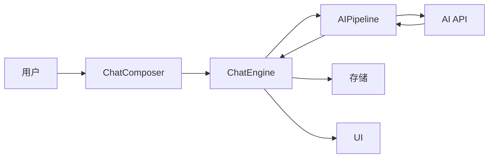

# Chat Buddy Remake

<div align="center">


**AI 聊天伴侣**

一个现代化的响应式AI聊天应用，支持多种个性角色、二次元角色、群聊和双语切换。

[English](README.md) | [中文](README.zh-CN.md)

</div>

---

## 目录

- [功能特性](#功能特性)
- [演示](#演示)
- [快速开始](#快速开始)
- [使用指南](#使用指南)
- [技术架构](#技术架构)
- [贡献指南](#贡献指南)
- [变更日志](#变更日志)

---

## 功能特性

### 🤖 AI好友系统

- **13位独特AI角色**：5位原创角色 + 8位二次元角色
- 每个角色拥有独特的性格、说话风格和兴趣爱好
- 基于DeepSeek API提供智能上下文感知回复

### 🎌 二次元角色

与你喜爱的动漫角色对话：

- **初音未来** - 活泼的虚拟偶像
- **雷姆** - Re:Zero中忠诚的女仆
- **远坂凛** - Fate系列的傲娇魔术师
- **漩涡鸣人** - 永不放弃的忍者
- **L** - 死亡笔记中的天才侦探
- **零二** - 神秘的Darling
- **亚丝娜** - 刀剑神域的勇敢剑士
- **五条悟** - 咒术回战中最强的男人

### 💬 群聊功能

- 创建包含多个AI的群组
- AI不仅与你互动，彼此之间也会交流
- 可为每个群组自定义AI能力

### 🌍 双语支持

- 中英文界面无缝切换
- 所有UI元素、文档和AI回复都支持双语

### 🎨 现代UI设计

- "马卡龙橙"主题，微信风格设计
- 流畅的动画和响应式布局
- 支持桌面和移动设备

### 💾 本地存储

- 聊天记录和设置保存在浏览器中
- 无需账号
- 注重隐私保护

### 🖼️ 沉浸式背景系统

- **100+ 预设背景**，12 个分类：AI 精选、热门 IP（进击的巨人、原神、女神异闻录 5…）、角色、自然、星空等
- **动态动画背景**：浮动粒子、北极光、倾盆雨、流动渐变——纯 CSS 实现，无 Canvas 开销
- **单聊自定义**：每个对话独立背景，自动回落（单聊 → 角色默认 → 全局主题）
- **视差效果**：鼠标跟踪图片背景的深度位移（可调强度）
- **视频背景**：输入 MP4/WebM 链接作为循环背景
- **时间自动切换**：白天（6:00–18:00）和夜晚使用不同背景
- **自定义上传**：Canvas 自动压缩（最大 1920×1080，JPEG 85%）
- **IndexedDB 存储**：自定义图片存入 IndexedDB，不占用 localStorage 5MB 配额
- **导出/导入**：将背景配置导出为便携式 `.json` 文件分享

### 🤖 智能 AI 功能 (v0.2.1)

- **动态在线状态**：基于角色作息的实时在线/忙碌/离线状态
- **可视化输入指示器**：带动画气泡的输入状态显示
- **主动问候**：长时间未互动或回归时 AI 主动发起对话
- **多条消息**：AI 可以像真人一样连续发送消息
- **微信风格时间显示**

### 📸 朋友圈增强 (v0.2.4)

- **AI 动态发布**：AI好友根据位置及性格发布日常生活动态
- **智能互动**：AI会智能点赞并评论你的内容，具有上下文感知能力
- **微信风格功能**：支持位置标签、隐私设置及封面照片
- **表情回应**：使用 😂❤️👍🔥😮😢 快速回应朋友圈内容

---

## 演示


---

## 快速开始

### 前置要求

| 要求             | 版本                 |
| ---------------- | -------------------- |
| Node.js          | v16+                 |
| npm              | v7+                  |
| DeepSeek API Key | 可选，用于AI智能回复 |

### 安装步骤

```bash
# 1. 克隆仓库
git clone https://github.com/Luckycat133/Chat_Buddy.git
cd Chat_Buddy

# 2. 安装依赖
npm install

# 3. 配置环境变量
# 复制.env.example为.env并编辑
cp .env.example .env
# 编辑.env配置你的API设置

# 4. 启动开发服务器
npm run dev
```

### 原生依赖故障排查（macOS Apple Silicon）

若出现以下报错：
- `Cannot find module @rollup/rollup-darwin-arm64`
- `Cannot find native binding`（`@tailwindcss/oxide`）
- `Cannot find module ../lightningcss.darwin-arm64.node`
- `The service was stopped`（`esbuild`）

执行：

```bash
rm -rf node_modules/@rollup/rollup-darwin-arm64 \
       node_modules/lightningcss \
       node_modules/lightningcss-darwin-arm64 \
       node_modules/@tailwindcss/oxide \
       node_modules/@tailwindcss/oxide-darwin-arm64
npm install
```

然后验证：

```bash
npm run lint
npm run test
npm run build
```

### 环境变量

| 变量              | 必需 | 说明                                        |
| ----------------- | ---- | ------------------------------------------- |
| `VITE_AI_API_URL` | 是   | API基础URL（如 `https://api.deepseek.com`） |
| `VITE_AI_API_KEY` | 是   | AI回复的API密钥                             |
| `VITE_AI_MODEL`   | 是   | 模型名称（如 `deepseek-chat`、`sonar`）     |

> **支持的API提供商**：DeepSeek、Perplexity、OpenAI及其他兼容OpenAI的API。

> **安全说明**：如果你在应用内设置面板中输入凭证，API 密钥只保存在当前浏览器会话中。保存的服务方案只保留地址和模型，不保存密钥。

---

## 使用指南

### 创建聊天

1. 点击 **"+"** 按钮或导航到"新建聊天"
2. 选择一个或多个AI好友
3. 群聊时可设置群名称
4. 点击"创建聊天"开始

### 聊天

1. 在输入框中输入消息
2. 按回车或点击发送
3. AI会根据其性格和上下文回复
4. 在群聊中，AI之间也可能互相交流

### 设置

- **语言**：切换中英文
- **主题**：马卡龙橙（默认）
- **API 配置**：保存的服务方案只保留接口地址和模型，设置页输入的 API 密钥仅当前会话有效
- **帮助**：查看FAQ和使用技巧
- **关于**：查看版本和变更日志

---

## 技术架构

> 详见 [docs/ARCHITECTURE.md](docs/ARCHITECTURE.md)

### 技术栈

- 前端：React 19, Vite
- 样式：TailwindCSS
- 状态：Clean Architecture (ChatEngine + Context)
- AI：DeepSeek / Perplexity / OpenAI 兼容 API
- 存储：LocalStorage（轻量设置）+ IndexedDB（聊天/文档主数据、媒体与背景资源）

### 项目结构

```
src/
├── core/               # 领域逻辑（纯 JS）
│   └── chat/
├── services/           # 基础设施（API, 存储）
├── features/           # 功能模块
│   ├── chat/
│   └── moments/
├── providers/          # Context 组合
├── components/         # 共享 UI
└── pages/              # 路由
```

### 数据流



---

## 贡献指南

欢迎贡献代码！请遵循以下规范：

### 如何贡献

1. **Fork** 本仓库
2. 创建 **功能分支**：`git checkout -b feature/amazing-feature`
3. **提交** 更改：`git commit -m 'Add amazing feature'`
4. **推送** 到分支：`git push origin feature/amazing-feature`
5. 提交 **Pull Request**

### 代码规范

- 使用ESLint进行JavaScript/JSX代码检查
- 遵循React最佳实践
- 编写有意义的提交信息
- 为新UI文本添加双语支持

### 报告问题

- 使用GitHub Issues
- 包含复现步骤
- 提供浏览器和操作系统信息

---

## 变更日志

查看 [CHANGELOG.zh-CN.md](CHANGELOG.zh-CN.md) 了解版本历史。

**当前版本**: v0.4.0 (2026-04-06)

### 最近更新

- 🎨 **马卡龙现代版** (v0.4.0): UI/UX 全面现代化；Bento 控制面板 v2；稳定的 HSL 颜色系统；现代化图标。
- 🤖 **专业智能体** (v0.3.3): 6 个专门的任务智能体 (代码、缪斯、学者、老师、极光、像素)；ReAct 工具调用；沙箱执行。
- 🧠 **认知记忆** (v0.3.0): 长期角色记忆；IndexedDB 存储；记忆交换工具；上下文感知的 AI。
- 📚 **RAG 系统** (v0.3.2): 知识库集成；混合搜索 (BM25 + Jaccard)；客户端文档索引。
- 📝 **草稿箱** (v0.2.7): 自动保存未发布状态；重新打开时恢复，一键丢弃。
- #️⃣ **话题标签** (v0.2.7)：动态中 `#话题` 可点击过滤朋友圈，顶部显示可关闭筛选条
- ⬇️ **分页加载** (v0.2.7)：默认展示 10 条，"加载更多"按钮逐批追加
- 🎂 **故事事件** (v0.2.7)：13 位角色生日当天自动发帖，元旦/情人节/万圣节/圣诞节节日特供
- 📤 **转发到聊天** (v0.2.7)：将朋友圈动态以格式化消息转发到任意会话
- 📋 **每日任务系统** (v0.2.6)：6 项每日任务，每天最多获得 165 积分
- 🔢 **猜数字游戏** (v0.2.6)：7 次机会猜出 1-100 的秘密数字，猜对得 30 积分
- 🎮 **游戏选择器** (v0.2.6)：在聊天中选择石头剪刀布或猜数字
- 🖼️ **沉浸式背景系统** (v0.2.5)：100+ 主题预设，动态动画，每个对话独立背景
- 💕 **亲密度系统** (v0.2.2)：5 级亲密等级，AI 语气随关系升温而变化
- 😊 **心情系统** (v0.2.2)：5 种心情影响 AI 回复风格
- 🌐 **动态在线状态** (v0.2.1)：根据角色时间表显示在线/忙碌/离线

---

## 许可证

MIT许可证 - 详见 [LICENSE](LICENSE)。

---

<div align="center">

**为动漫爱好者和AI爱好者用 ❤️ 制作**

[⬆ 返回顶部](#chat-buddy-remake)

</div>
