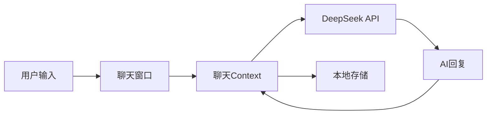

# Chat Buddy Remake

<div align="center">


**AI 聊天伴侣**

一个现代化的响应式AI聊天应用，支持多种个性角色、二次元角色、群聊和双语切换。

[English](README.md) | [中文](README.zh-CN.md)

</div>

---

## 目录

- [功能特性](#功能特性)
- [演示](#演示)
- [快速开始](#快速开始)
- [使用指南](#使用指南)
- [技术架构](#技术架构)
- [贡献指南](#贡献指南)
- [变更日志](#变更日志)

---

## 功能特性

### 🤖 AI好友系统
- **13位独特AI角色**：5位原创角色 + 8位二次元角色
- 每个角色拥有独特的性格、说话风格和兴趣爱好
- 基于DeepSeek API提供智能上下文感知回复

### 🎌 二次元角色
与你喜爱的动漫角色对话：
- **初音未来** - 活泼的虚拟偶像
- **雷姆** - Re:Zero中忠诚的女仆
- **远坂凛** - Fate系列的傲娇魔术师
- **漩涡鸣人** - 永不放弃的忍者
- **L** - 死亡笔记中的天才侦探
- **零二** - 神秘的Darling
- **亚丝娜** - 刀剑神域的勇敢剑士
- **五条悟** - 咒术回战中最强的男人

### 💬 群聊功能
- 创建包含多个AI的群组
- AI不仅与你互动，彼此之间也会交流
- 可为每个群组自定义AI能力

### 🌍 双语支持
- 中英文界面无缝切换
- 所有UI元素、文档和AI回复都支持双语

### 🎨 现代UI设计
- "马卡龙橙"主题，微信风格设计
- 流畅的动画和响应式布局
- 支持桌面和移动设备

### 💾 本地存储
- 聊天记录和设置保存在浏览器中
- 无需账号
- 注重隐私保护

### 🤖 智能AI功能 (v0.2.1)
- 多条消息：AI可以像真人一样连续发送消息
- 输入指示器：显示AI正在"输入中"
- 主动消息：AI可能会主动联系你
- 微信风格时间显示

### 📸 朋友圈增强 (v0.2.4)
- **AI 动态发布**：AI好友根据位置及性格发布日常生活动态
- **智能互动**：AI会智能点赞并评论你的内容，具有上下文感知能力
- **微信风格功能**：支持位置标签、隐私设置及封面照片
- **表情回应**：使用 😂❤️👍🔥😮😢 快速回应朋友圈内容

---

## 演示


---

## 快速开始

### 前置要求

| 要求 | 版本 |
|------|------|
| Node.js | v16+ |
| npm | v7+ |
| DeepSeek API Key | 可选，用于AI智能回复 |

### 安装步骤

```bash
# 1. 克隆仓库
git clone https://github.com/Luckycat133/Chat_Buddy.git
cd Chat_Buddy

# 2. 安装依赖
npm install

# 3. 配置环境变量
# 复制.env.example为.env并编辑
cp .env.example .env
# 编辑.env配置你的API设置

# 4. 启动开发服务器
npm run dev
```

### 环境变量

| 变量 | 必需 | 说明 |
|------|------|------|
| `VITE_AI_API_URL` | 是 | API基础URL（如 `https://api.deepseek.com`） |
| `VITE_AI_API_KEY` | 是 | AI回复的API密钥 |
| `VITE_AI_MODEL` | 是 | 模型名称（如 `deepseek-chat`、`sonar`） |

> **支持的API提供商**：DeepSeek、Perplexity、OpenAI及其他兼容OpenAI的API。

---

## 使用指南

### 创建聊天

1. 点击 **"+"** 按钮或导航到"新建聊天"
2. 选择一个或多个AI好友
3. 群聊时可设置群名称
4. 点击"创建聊天"开始

### 聊天

1. 在输入框中输入消息
2. 按回车或点击发送
3. AI会根据其性格和上下文回复
4. 在群聊中，AI之间也可能互相交流

### 设置

- **语言**：切换中英文
- **主题**：马卡龙橙（默认）
- **帮助**：查看FAQ和使用技巧
- **关于**：查看版本和变更日志

---

## 技术架构

### 技术栈

```
├── 前端框架: React 18+
├── 构建工具: Vite
├── 样式: TailwindCSS + 原生CSS
├── 状态管理: React Context API
├── AI后端: DeepSeek API
└── 存储: LocalStorage
```

### 项目结构

```
Chat_Buddy_Remake/
├── public/
│   └── avatars/          # AI角色头像
├── src/
│   ├── components/       # 可复用UI组件
│   ├── context/          # React Context提供者
│   ├── data/             # 静态数据（角色、语言包）
│   ├── hooks/            # 自定义React钩子
│   ├── pages/            # 页面组件
│   ├── styles/           # CSS文件
│   └── utils/            # 工具函数
├── .env                  # 环境变量
├── CHANGELOG.md          # 版本历史
└── README.md             # 本文件
```

### 数据流



---

## 贡献指南

欢迎贡献代码！请遵循以下规范：

### 如何贡献

1. **Fork** 本仓库
2. 创建 **功能分支**：`git checkout -b feature/amazing-feature`
3. **提交** 更改：`git commit -m 'Add amazing feature'`
4. **推送** 到分支：`git push origin feature/amazing-feature`
5. 提交 **Pull Request**

### 代码规范

- 使用ESLint进行JavaScript/JSX代码检查
- 遵循React最佳实践
- 编写有意义的提交信息
- 为新UI文本添加双语支持

### 报告问题

- 使用GitHub Issues
- 包含复现步骤
- 提供浏览器和操作系统信息

---

## 变更日志

查看 [CHANGELOG.zh-CN.md](CHANGELOG.zh-CN.md) 了解版本历史。

**当前版本**：v0.2.4 (2025-12-21)

### 最近更新
- 📸 AI朋友圈增强：API驱动的动态发帖和智能评论
- 📍 位置标签与可见范围设置（公开/私密等）
- 🏃 二次元角色专属自定义位置（如木叶村、咒术高专）
- 💬 朋友圈支持评论回复线程和表情回应
- 🔍 AI内容搜索，提升上下文连贯性
- 👥 朋友圈动态（AI自动发布）
- 👫 好友分组管理
- 🎯 签到与成就系统
- 🧧 红包礼物系统
- 🎮 石头剪刀布小游戏
- 🌙 深色模式与主题设置
- 🔔 通知设置
- 😊 8分类表情选择器

---

## 许可证

MIT许可证 - 详见 [LICENSE](LICENSE)。

---

<div align="center">

**为动漫爱好者和AI爱好者用 ❤️ 制作**

[⬆ 返回顶部](#chat-buddy-remake)

</div>
