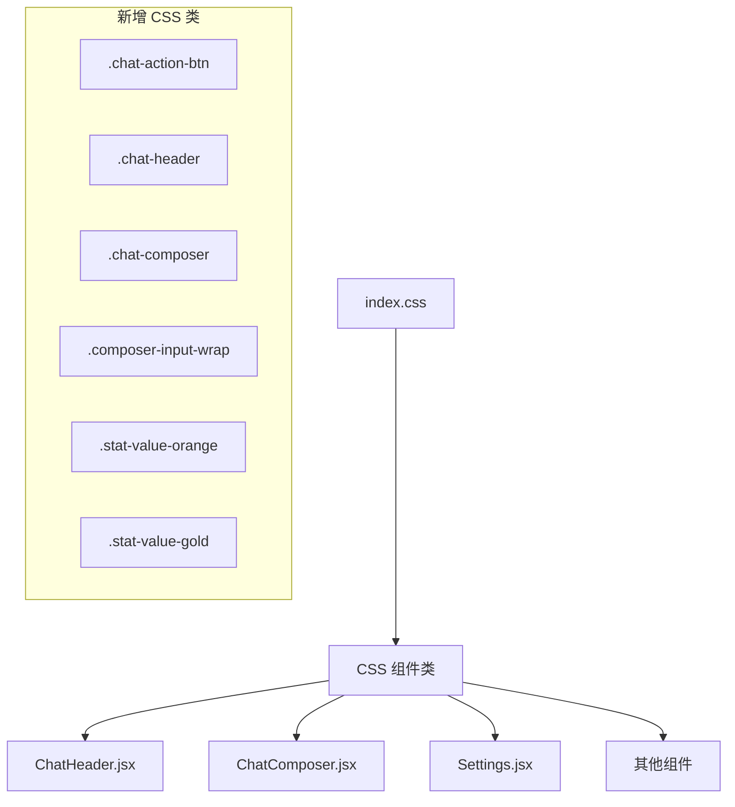

# T03 Phase 4 — Design Document

## 架构设计

本次重构不涉及架构变更，属于纯表现层优化。

## 核心修改

### 1. 新增 CSS 组件类 (index.css)

| 类名 | 用途 | 替代的内联样式 |
|------|------|---------------|
| `.chat-action-btn` | ChatHeader 动作按钮 | `p-2.5 rounded-xl hover:bg-[var(--color-bg-hover)]...` (重复4次) |
| `.chat-header` | 聊天顶栏容器 | `px-4 py-3 glass-strong flex items-center...` |
| `.chat-header-name` | 角色名称 | `font-semibold text-[var(--color-text-main)]...` |
| `.chat-header-status` | 状态文字 | `text-xs text-[var(--color-text-muted)]...` |
| `.composer-wrap` | 输入区容器 | `flex flex-col relative z-20...` |
| `.composer-box` | 输入框外壳 | `glass-crystal rounded-[var(--radius-xl)]...` |
| `.composer-input-wrap` | 输入框包装 | 长串内联样式 |
| `.composer-btn` | 输入区按钮 | `p-3 rounded-full transition-all...` |
| `.composer-send-btn` | 发送按钮 | aurora 渐变发送按钮 |
| `.plus-menu` | 加号弹出菜单 | `glass-crystal rounded-[var(--radius-xl)]...` |
| `.plus-menu-btn` | 菜单按钮组 | 多行内联样式 |
| `.mention-dropdown` | @提及下拉 | `glass-crystal rounded-[var(--radius-lg)]...` |
| `.quote-preview` | 引用预览条 | `glass-crystal rounded-[var(--radius-lg)]...` |

### 2. Settings 优化

- 用 CSS 变量替代 `style={{ color: '#FF9800' }}` → `.stat-value-streak`
- 用 CSS 变量替代 `style={{ color: '#FFD700' }}` → `.stat-value-points`

### 3. 无障碍增强

- 确认所有 `<button>` 有 `aria-label`
- `role="menu"` 用于下拉菜单
- `role="menuitem"` 用于菜单项
- `aria-expanded` 用于可展开控件

## 数据流向

无变化 — 本次修改不涉及数据流。

## 异常处理策略

无变化 — 本次修改不涉及逻辑层。
