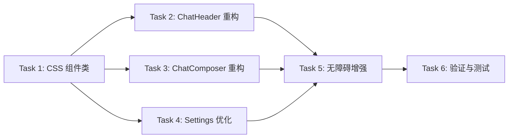

# T03 Phase 4 — Task Document

## 任务依赖图

## 子任务列表

### Task 1: 新增 CSS 组件类
**输入**: index.css, 现有内联样式模式
**输出**: index.css 新增 chat 和 composer 相关 CSS 类
**验收**: CSS 类定义完整，包含 dark mode 变体

### Task 2: ChatHeader 样式重构
**输入**: ChatHeader.jsx, 新 CSS 类
**输出**: ChatHeader.jsx 使用 CSS 类替代内联样式
**验收**: 视觉效果完全一致，4 个动作按钮使用统一的 .chat-action-btn

### Task 3: ChatComposer 样式重构
**输入**: ChatComposer.jsx, 新 CSS 类
**输出**: ChatComposer.jsx 使用 CSS 类替代内联样式
**验收**: 视觉效果完全一致，代码可读性提升

### Task 4: Settings 页面优化
**输入**: Settings.jsx
**输出**: 移除硬编码颜色，使用 CSS 变量
**验收**: 无 style={{ color: '#...' }} 硬编码

### Task 5: 无障碍增强
**输入**: ChatHeader, ChatComposer, Settings
**输出**: 完整的 ARIA 属性
**验收**: 所有交互元素有 aria-label, role 属性正确

### Task 6: 构建验证
**输入**: 所有修改文件
**输出**: npm run build 通过
**验收**: 无编译错误，无 ESLint 错误
