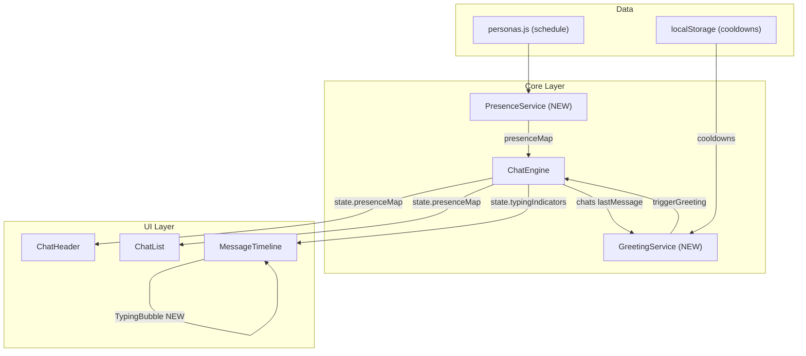
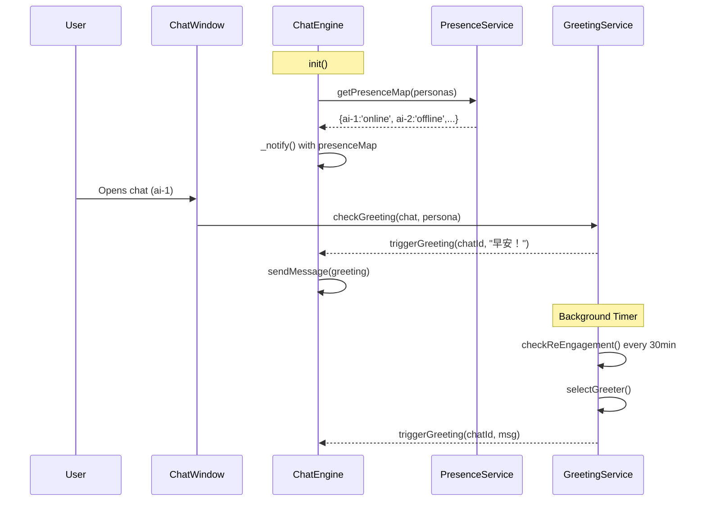

# DESIGN — T05 AI Humanization

## 1. Architecture Overview



## 2. New Module: PresenceService

**文件**: `src/core/presence/PresenceService.js`

**职责**: 根据 persona.schedule 和当前时间计算每个 AI 的在线状态。

### Interface

```js
class PresenceService {
  // 返回 { personaId: 'online' | 'offline' | 'busy' }
  getPresenceMap(personas) → Object

  // 获取单个 persona 状态
  getStatus(persona) → 'online' | 'offline' | 'busy'
}
```

### Logic

```
function getStatus(persona):
  now = currentHour (in persona.timezone)
  if isInSleepRange(now, persona.schedule.sleep):
    return 'offline'
  if isInBusyRange(now, persona.schedule.busy):
    return 'busy'   // 忙碌但仍可能回复（延迟更大）
  return 'online'
```

> **注意**: 部分 persona (如 Rem) 没有 `schedule`，默认返回 `'online'`。

## 3. New Module: GreetingService

**文件**: `src/core/presence/GreetingService.js`

**职责**: 管理主动问候逻辑和频率控制。

### 触发场景

| 触发              | 条件                                | 行为                          |
| ----------------- | ----------------------------------- | ----------------------------- |
| **Window Open**   | 用户打开聊天 && lastMessage > 6h 前 | 该聊天的 AI 发一条问候        |
| **Re-engagement** | 全局无任何消息 > 12h                | 系统选择 1 个角色发送回流消息 |

### Cooldown 规则

- **Per-persona**: 12h (同一角色不会短时间重复问候)
- **Global**: 4h (任意角色问候后，全局冷却)
- 持久化到 `localStorage` key: `chat-buddy-greeting-cooldowns`

### 角色选择算法 (Re-engagement)

```
function selectGreeter(chats, personas, cooldowns):
  candidates = personas.filter(p =>
    p.agentType === 'social-companion' &&
    !cooldowns[p.id] &&
    getStatus(p) === 'online'  // 只有在线的才会主动发
  )
  if candidates.empty: return null

  // 按 "最久未互动" 排序 (心理学：想念效应)
  sort candidates by lastInteractionTime ASC
  return candidates[0]
```

### 问候内容生成

- 基于时间段生成简单模板
- 早: 6-9 → "早安" 类; 午: 12-14 → "午好" 类; 晚: 18-21 → "晚上好" 类; 深夜: 22+ → "还没睡？" 类
- 回流: "好久不见！最近怎么样？" 类
- **不调用 LLM**，使用预设模板 + 角色语气修饰，性能零开销。

## 4. ChatEngine Changes

**文件**: `src/core/chat/ChatEngine.js`

### 新增状态

```diff
  constructor() {
    ...
    this.typingIndicators = {};
+   this.presenceMap = {};      // { personaId: 'online'|'offline'|'busy' }
  }
```

### 新增方法

```js
// 初始化时启动 Presence 定时刷新
_startPresenceUpdates(personas) {
  this._updatePresence(personas);
  this._presenceInterval = setInterval(() => {
    this._updatePresence(personas);
  }, 60_000); // 每分钟刷新
}

_updatePresence(personas) {
  this.presenceMap = presenceService.getPresenceMap(personas);
  this._notify();
}
```

### \_notify 扩展

```diff
  _notify() {
    const state = {
      chats: this.chats,
      typingIndicators: { ...this.typingIndicators },
+     presenceMap: { ...this.presenceMap }
    };
    this.listeners.forEach(cb => cb(state));
  }
```

## 5. UI Changes

### 5.1 ChatHeader (Online Status)

**文件**: `src/features/chat/components/window/ChatHeader.jsx`

- 接收 `presenceMap` prop
- 头像旁的小圆点：
  - `online` → 绿色 (现有)
  - `busy` → 橙色/黄色
  - `offline` → 灰色
- 副标题文字更新：
  - `online` → "在线" / "Online"
  - `busy` → "忙碌中" / "Busy"
  - `offline` → "离线" / "Offline"

### 5.2 MessageTimeline (Typing Bubble)

**文件**: `src/features/chat/components/window/MessageTimeline.jsx`

在消息列表末尾 (`messagesEndRef` 之前) 增加 Typing Bubble：

```jsx
{
  typingAIs.length > 0 && (
    <div className="flex mb-4 justify-start bubble-enter">
      <div className="flex gap-2.5">
        <AvatarOfTypingAI />
        <div className="typing-bubble">
          <span className="typing-dot" />
          <span className="typing-dot" style={{ animationDelay: "0.15s" }} />
          <span className="typing-dot" style={{ animationDelay: "0.3s" }} />
        </div>
      </div>
    </div>
  );
}
```

### 5.3 ChatList (Online Badge)

**文件**: `src/features/chat/ChatList.jsx`

- 在聊天列表头像右下角添加小圆点 (同 ChatHeader 逻辑)。

### 5.4 CSS

**文件**: `src/index.css`

新增 `.typing-bubble` 样式组件。

## 6. Data Flow



## 7. Quality Gate

- 架构图清晰准确 ✅
- 接口定义完整 ✅
- 与现有系统无冲突 (复用 schedule, 扩展 \_notify) ✅
- 不引入新依赖 ✅
