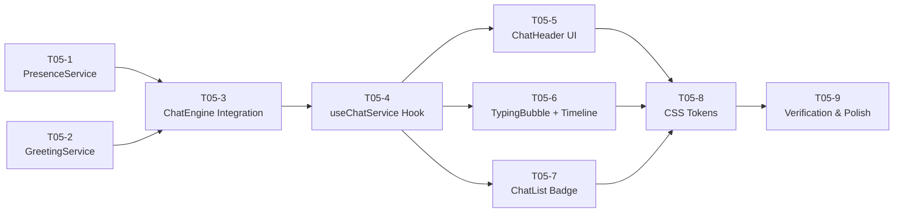

# TASK — T05 AI Humanization

## 子任务拆分

---

### T05-1: PresenceService ✅

- **New File**: `src/core/presence/PresenceService.js`

### T05-2: GreetingService ✅

- **New File**: `src/core/presence/GreetingService.js`

### T05-3: ChatEngine Integration ✅

- **Modify**: `src/core/chat/ChatEngine.js`

### T05-4: useChatService Hook ✅

- **Modify**: `src/features/chat/hooks/useChatService.js`

### T05-5: ChatHeader UI ✅

- **Modify**: `src/features/chat/components/window/ChatHeader.jsx`

### T05-6: TypingBubble + MessageTimeline ✅

- **Modify**: `src/features/chat/components/window/MessageTimeline.jsx`
- **New File**: `src/features/chat/components/window/TypingBubble.jsx`

### T05-7: ChatList Badge ✅

- **Modify**: `src/features/chat/ChatList.jsx`

### T05-8: CSS Tokens ✅

- **Modify**: `src/index.css`

### T05-9: Verification & Polish ✅

- Build 验证 (`vite build`)
- Lint 验证 (`npx eslint .`)
- 文档更新 (`ALIGNMENT_T05.md`, `CHANGELOG.md`, `README.md`)
