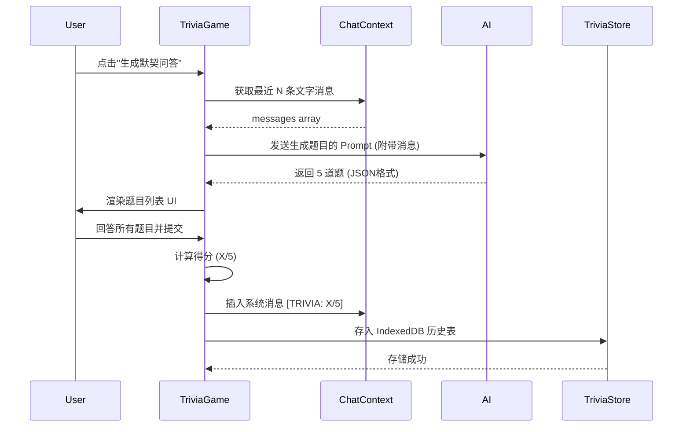
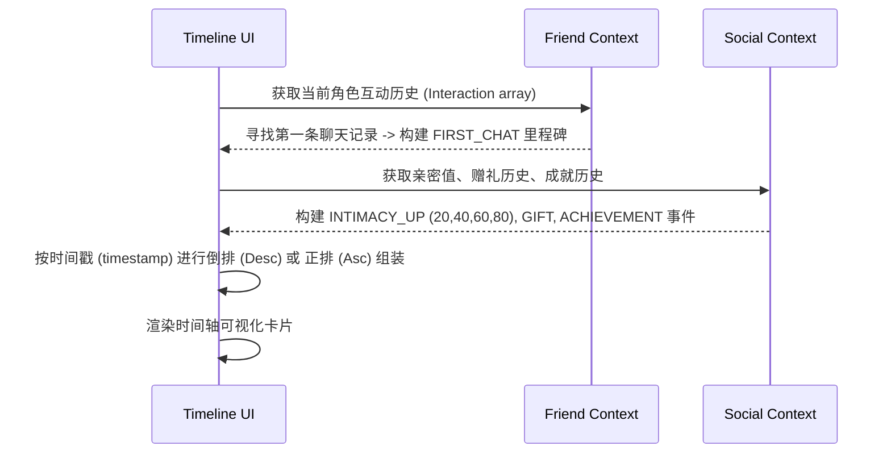

# DESIGN: T10 Social & Interaction Features (Phase 3)

## 1. 整体架构图

```mermaid
graph TD
    %% 用户入口界面
    subgraph UI层 (View)
        GameSelector[GameSelectorPanel]
        ChatComposer[ChatComposer 菜单]
        FriendDetail[FriendDetail 界面]
        Achievements[AchievementsPage]
    end

    %% 新增功能交互组件
    subgraph 核心组件层 (Components)
        IdiomGame[IdiomChainGame.jsx]
        TriviaGame[TriviaQuizGame.jsx]
        Timeline[InteractionTimeline.jsx]
        Leaderboard[StatsLeaderboard.jsx]
    end

    %% 全局状态与领域逻辑
    subgraph 状态与领域层 (Contexts/Services)
        ChatContext[ChatContext]
        FriendContext[FriendContext]
        SocialContext[SocialContext]
        PointsCtx[User/Points Context]
        TriviaStore[TriviaStore.js <br/>IndexedDB]
    end

    %% 外部整合
    subgraph 外部服务层 (Infra)
        AI[AI Service: callAI]
        Storage[localStorage / LocalForage]
    end

    %% 依赖与控制流
    GameSelector --> |触发并渲染| IdiomGame
    ChatComposer --> |触发并渲染| TriviaGame
    FriendDetail --> |触发弹窗| Timeline
    Achievements --> |内嵌渲染| Leaderboard

    IdiomGame --> |状态流转/判定| AI
    IdiomGame --> |结算奖励| PointsCtx
    IdiomGame --> |广播游戏结果| ChatContext

    TriviaGame --> |提取上下文消息| ChatContext
    TriviaGame --> |请求生成题目| AI
    TriviaGame --> |读写/缓存测验记录| TriviaStore
    TriviaGame --> |结算结果| PointsCtx
    TriviaGame --> |广播成绩| ChatContext

    Timeline --> |提取交互/签到/礼物记录| FriendContext
    Timeline --> |提取亲密值/成就进度| SocialContext
    Timeline --> |写入里程碑缓存| Storage

    Leaderboard --> |读取积分| PointsCtx
    Leaderboard --> |读取所有角色对话数| ChatContext
    Leaderboard --> |读取总游戏/胜率| SocialContext
    Leaderboard --> |读取成就记录| Storage
```

---

## 2. 分层设计和核心组件

本次迭代基于现有架构（View - Context - Service/Storage），将新功能合理插入不同边界内：

### 2.1 表现层 (UI/View)
* **`IdiomChainGame.jsx`**: 基于当前的 Chat Game 懒加载模式，复用现有的聊天卡片 UI（参考 NumberGuessGame）。提供成语提交表单、进度显示及 AI 回复展示。
* **`TriviaQuizGame.jsx`**: 独立的全屏抽屉或聊天室内的互动卡片。具备「当前题目问答区」与「历史记录标签页」。
* **`InteractionTimeline.jsx`**: 独立全屏或中心化 Modal 弹窗，采用时间轴样式（纵向线条+卡片）展示时间事件节点。
* **`StatsLeaderboard.jsx`**: `AchievementsPage` 内置数据面板模块。通过 Flex/Grid 布局展示多项数据统计模块。

### 2.2 领域与服务层 (Services/Store)
* **`TriviaStore.js` (新增)**:
  封装针对 `IndexedDB` (或现有的基于 localForage 封装) 的读写：`saveQuizResult(quiz)`、`getHistoryByCharacter(characterId)`等。
* **`里程碑推导逻辑`**:
  在调用 `Timeline` 时，由顶层统一计算或在 `FriendContext` 中增加辅助方法（如 `computeMilestones()`），合并聊天首次记录、亲密升级和赠礼。

---

## 3. 模块依赖关系

```mermaid
graph LR
    IdiomChainGame --> locale[src/data/locales.js]
    IdiomChainGame --> useChat[useChat()]
    IdiomChainGame --> api[callAI()]

    TriviaQuizGame --> TriviaStore[TriviaStore.js]
    TriviaQuizGame --> api
    TriviaQuizGame --> useChat

    InteractionTimeline --> useFriend[useFriend()]
    InteractionTimeline --> useSocial[useSocial()]

    StatsLeaderboard --> usePoints[usePoints/useGameStats]
    StatsLeaderboard --> useChat
    StatsLeaderboard --> useSocial
```

---

## 4. 接口契约定义

### 4.1 AI API: 成语接龙 Prompt 结构
**输入契约**: 传入当前用户成语给 `callAI`
**输出契约 (期望 JSON 或文本)**: 
```json
{
  "valid": true,
  "next_idiom": "山穷水尽",
  "explanation": "成语解释...",
  "status": "continue|win|lose"
}
```

### 4.2 AI API: Trivia Quiz 生成 Prompt
**输入契约**: `callAI(messages, config)`，传入用户的最近约 50 条聊天记录上下文，指示 AI 生成 5 个选择题。
**输出契约 (严格 JSON)**:
```json
{
  "questions": [
    {
      "q": "我们在上周讨论了哪个科幻电影？",
      "options": ["星际穿越", "沙丘", "流浪地球", "火星救援"],
      "answer": 1  // 数组索引
    }
  ]
}
```

### 4.3 TriviaStore 存储结构 (IndexedDB)
**Entity: `QuizHistory`**
```typescript
interface QuizHistory {
  id: string; // uuid
  chatId: string; // 对应会话 ID
  personaId: string; // 对话角色的 ID
  generatedAt: number; // 时间戳
  score: number;
  total: number;
  questions: Array<{
    q: string;
    options: string[];
    answer: number; 
    userAnswer: number | null; 
    correct: boolean;
  }>
}
```

### 4.4 Timeline 事件结构契约
**TimelineEvent** 在渲染前组装统一样式结构：
```typescript
interface TimelineEvent {
  id: string;
  type: 'FIRST_CHAT' | 'INTIMACY_UP' | 'GIFT' | 'ACHIEVEMENT';
  timestamp: number;
  title: string;
  description: string;
  meta?: any; // e.g. 亲密度达到的数值, 礼物的名称
}
```

---

## 5. 数据流向图

### 5.1 测验生成与存储流


### 5.2 互动时间轴生成流


---

## 6. 异常处理策略

1. **AI 响应解析错误 (Trivia / Idiom Chain)**:
   - *策略*: 使用 try/catch 解析 AI 返回的 JSON，若失败则提供默认友好的备用回退提示（“太难了，我暂时想不出题目/成语，再试一次吧~”），不阻塞系统运行。
2. **IndexedDB 读写失败 / 浏览器不支持**:
   - *策略*: 测验记录提供 `Memory`/`localStorage` 降级策略，或仅作单次展示而不存历史；通过控制台报错，但不引起白屏崩溃。
3. **缺少历史记录 (生成问答时不足 5 条)**:
   - *策略*: 拦截生成请求，直接弹窗提示“你们的对话记录还不够多，多跟我聊聊再来测试默契吧~”，避免 AI 产出幻觉题目。
4. **组件懒加载失败**:
   - *策略*: 在现有的 `<Suspense>` / Error Boundary 中安全捕获，显示“加载游戏模块失联”的备用面板。

---

## 7. 下一步
完成架构设计后，进入 `Atomize (原子化阶段)`，将设计转化为逐步可执行的子任务清单（ TASK_T10_Social_Interaction.md ），并定义依赖关系树。
