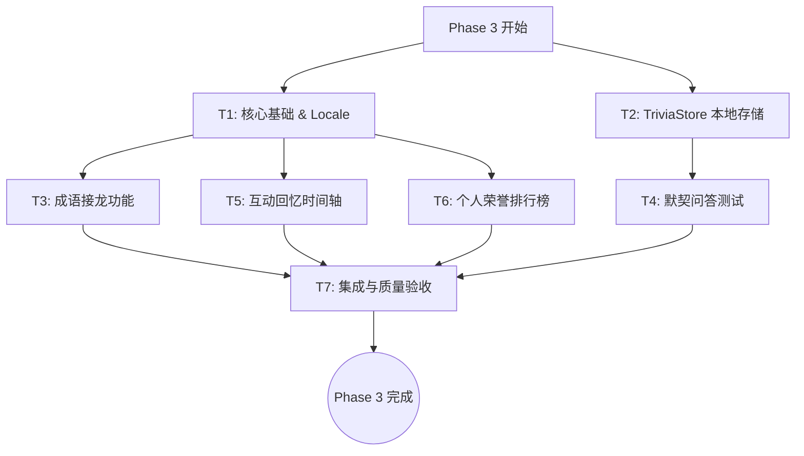

# TASK: T10 Social & Interaction Features (Phase 3)

## 1. 任务子任务拆分与原子任务

### 任务 1：核心基础与多语言配置编排 (T10-Core-Locale)
*   **输入契约**: 设计文档对提示文字和静态文本的需求。
*   **输出契约**: 更新 `src/data/locales.js`，加入成语接龙、测验、时间轴、排行榜的全部相关词条。
*   **实现约束**: 支持中文 (`zh`) 与英文 (`en`)，不过成语接龙的名称要在英文版标注 (Chinese Only)。
*   **依赖关系**: 依赖基础工程准备。作为后续 UI 开发的前置依赖。

### 任务 2：本地存储数据层设计与更新 (T10-Store-DB)
*   **输入契约**: TriviaStore 的 IndexedDB 数据结构需求，以及 FriendContext 对互动记录的需求。
*   **输出契约**: 
    1.  新增 `src/features/chat/services/TriviaStore.js` (基于 IndexedDB/localForage)。
    2.  `TriviaStore` 暴露 `saveQuizResult`, `getHistoryByCharacter`, `clearHistory` 接口。
    3.  （可选）扩展 localStorage 以存放各模块的轻量缓存，确保无依赖读取。
*   **实现约束**: 使用异步的 Promise API 进行读写。数据降级处理：读写失败时退回内存模式。
*   **依赖关系**: 依赖基础工程准备，作为 Trivia Quiz (任务4) 的前置。

### 任务 3：成语接龙功能 (T10-Idiom-Chain)
*   **输入契约**: 用户的输入文本，系统 `callAI` 配置（提供正确的裁判 Prompt），角色语境参数。
*   **输出契约**: 
    1.  新增懒加载组件 `src/features/chat/components/IdiomChainGame.jsx`。
    2.  通过 AI 评判成语是否合法，解析 JSON 结果。
    3.  如果成功 `usePoints().addPoints(5)`。
    4.  通过 `ChatContext.addMessage` 广播 `[GAME:IDIOM:成功轮数]`。
*   **实现约束**: `GameSelectorPanel.jsx` 中增加选项，并且仅当 `language === 'zh'` 时显示此游戏卡。
*   **依赖关系**: 后置：T10-Core-Locale。可并行开发。

### 任务 4：默契问答测试功能 (T10-Trivia-Quiz)
*   **输入契约**: `ChatContext.messages` (最近 50 条上下文)，当前角色 ID 和头像，AI 题目生成 Prompt。
*   **输出契约**: 
    1.  新增组件 `src/features/chat/components/TriviaQuizGame.jsx`。
    2.  `ChatComposer.jsx` 中新增「生成问答测试」入口。
    3.  完成作答后，更新本地 `TriviaStore` 分数，插入 `[TRIVIA:得分/5]`。 
*   **实现约束**: 生成题目期间显示 Loading 动效。严格按契约解析 JSON。数据不足时拦截调用。
*   **依赖关系**: 依赖 T10-Store-DB 的数据存取。可并行开发。

### 任务 5：互动回忆时间轴功能 (T10-Friend-Timeline)
*   **输入契约**: `FriendContext`, `SocialContext` 提供的好友里程碑数据流。
*   **输出契约**: 
    1.  新增独立 UI `src/components/InteractionTimeline.jsx` (沉浸弹窗/全屏卡片)。
    2.  根据首次聊天、亲密值门槛（20, 40, 60, 80）、首次收礼，生成时间轴事件（时间戳排序）。
    3.  在 `FriendDetail.jsx` 头像或按钮区旁暴露「查看回忆」入口。
*   **实现约束**: UI 使用清晰的横向/纵向 Timeline 设计（左日期+右事件/图标）。里程碑应动态提取现有记录。
*   **依赖关系**: 依赖既有 Social/Friend 数据模型，可独立并行。

### 任务 6：个人荣誉排行榜 (T10-Stats-Leaderboard)
*   **输入契约**: `PointsModel` 总积分资源，`SocialContext` 的全角色交往信息，`Achievements` 解锁状态。
*   **输出契约**: 
    1.  新增组件 `src/components/StatsLeaderboard.jsx`。
    2.  在 `AchievementsPage.jsx` 内嵌展示。数值包括：总积分、最长连续签到、Top 3 亲密互动角色及条数等。
*   **实现约束**: 无需外部后端接口。避免过度设计，注重图文排版（采用数据卡片形式）。
*   **依赖关系**: 可独立开发。

### 任务 7：质量与路由验收 (T10-Integration-QA)
*   **输入契约**: 全新 T10 功能模块组件与变更后的状态服务。
*   **输出契约**: `ROADMAP.md` 同步状态；所有入口进行点击测试并满足 Acceptance Criteria。
*   **实现约束**: 覆盖多语言、多主题检查（亮色/暗色）；容错处理复测。
*   **依赖关系**: 作为终点节点，须所有任务完成后方可执行。

---

## 2. 任务依赖图 (DAG)

---

## 3. 下一步执行指引

我们目前已经具备了对 T10 的完全了解与规划。接下来可以进入 **阶段 4: Approve (审批阶段)**。
请您确认以上这些原子任务拆分合适（按难度与独立性已划分为 7 个环节），如无问题，我们将直接开始**自动化执行 (Automate阶段)**，按子任务逐一开始编码。
