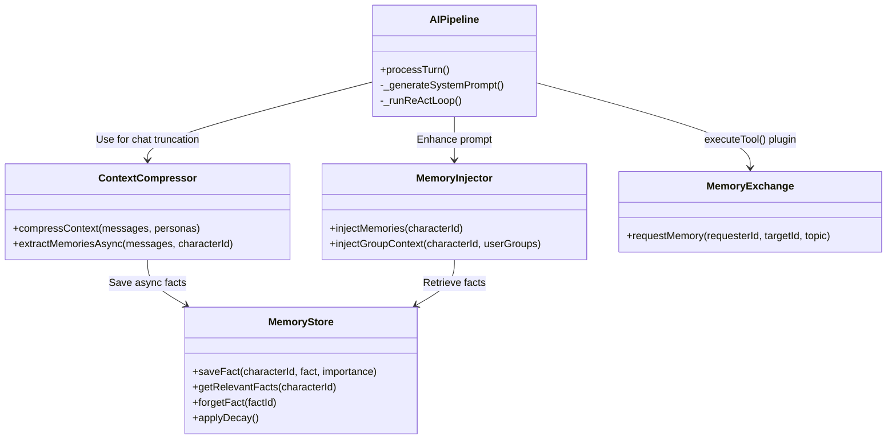

# 架构设计 (Architecture Design)：T12 AI Memory & Cognitive System

## 1. 整体架构图

```mermaid
graph TD
    subgraph UI Layer
        SettingsUI[Character Settings UI]
        ChatWindow[Chat Window]
    end

    subgraph Chat Controller / Pipeline
        AIPipeline[AIPipeline]
        ChatEngine[ChatEngine]
    end

    subgraph Cognitive Layer
        ContextCompressor[ContextCompressor]
        MemoryInjector[MemoryInjector]
        MemoryExchange[MemoryExchange]
    end

    subgraph Infrastructure Layer
        MemoryStore[MemoryStore (IndexedDB)]
        LLM[LLM API / aiClient]
    end

    SettingsUI -->|Read/Delete Memory| MemoryStore
    ChatWindow -->|Send Msg| ChatEngine
    ChatEngine -->|Pass Messages| AIPipeline
    
    AIPipeline -->|Compression Trigger| ContextCompressor
    ContextCompressor -.->|Async Extraction| LLM
    LLM -.->|Extracted Facts| MemoryStore
    
    AIPipeline -->|Before System Prompt| MemoryInjector
    MemoryInjector -->|Load Facts| MemoryStore
    MemoryInjector -->|Load Group Context| ChatEngine
    
    AIPipeline -->|Tool Call MEMORY_REQUEST| MemoryExchange
    MemoryExchange -->|Background Request| LLM
```

## 2. 分层设计和核心组件

- **Domain/Core (认知层组件)**
  - `ContextCompressor.js`：从 `chatService.js` 中剥离，负责对话摘要、记忆提取(Extraction)。当对话数量超出阈值需要截断时，除了生成摘要，还在后台使用模型提取针对用户的长久记忆事实。
  - `MemoryInjector.js`：负责组装上下文。在 `AIPipeline.js` 生成提示词前，根据请求的角色，从 Store 中捞取高相关或高重要度的事实，以及抽取最近群聊记录的摘要，附加到 `systemPrompt` 中。
  - `MemoryExchange.js`：解析和执行 `[MEMORY_REQUEST: target=Name, topic=Content]` 工具。构造隐藏的上下文询问被请求角色的看法，拿到结果后作为 TOOL_RESULT 交还请求角色继续输出。

- **Infrastructure (基础设施层)**
  - `MemoryStore.js`：封装基于 IndexedDB 的 Store (例:`character_memories`)，处理单条记忆对象的 CRUD。带衰减评分计算策略 (`decay function`)。

## 3. 模块依赖关系图



## 4. 接口契约定义

**Memory Record 结构体 (`MemoryStore`)**:
```javascript
{
  id: "uuid",
  characterId: "ai-1",
  fact: "User likes to drink coffee in the morning and plays guitar",
  category: "preference", // preference, fact, event
  importance: 7, // 1-10
  timestamp: 1715494200000,
  lastRecalledAt: 1715494200000,
  isForgotten: false
}
```

**ContextCompressor (提取接口)**:
```javascript
/**
 * 异步大模型调用，无侧效应，后台记录事实
 * @param {Array} messages - 这批截短的旧消息
 * @param {string} characterId - 当前角色ID
 */
async extractMemoriesAsync(messages, characterId)
```

**MemoryExchange (请求接口)**:
```javascript
/**
 * `tools` 里新增的功能处理实现 
 * @param {string} requesterId - 请求方
 * @param {string} targetId - 目标方
 * @param {string} topic - 主题或问题
 * @returns {Promise<string>} 目标角色的分享回应
 */
async requestMemory(requesterId, targetId, topic)
```

## 5. 数据流向图 (Data Flow)

**记忆写入流**：
用户发送消息 -> 上下文积累超标 -> `ContextCompressor.compressContext` -> 截断前N条 -> 并行后台触发 `extractMemoriesAsync(N条消息)` -> LLM返回 JSON Array -> `MemoryStore.saveFact` -> 异步写入 IndexedDB。

**记忆读取/注入流**：
角色思考前 (`processTurn`) -> `MemoryInjector.injectMemories` 拉取尚未 `isForgotten` 的相关重要事实 (更新 `lastRecalledAt` 减缓衰减) -> 结合 `injectGroupContext` 抓取最近相关的群聊 -> 拼接到 System Prompt 给大模型。

**跨角色记忆流**:
AI 解析思维块产生 `[MEMORY_REQUEST: target=Max, topic="Why is user sad?"]` -> `toolService.executeTool` 分配执行 -> `MemoryExchange.requestMemory` -> 生成针对 Max 的系统角色 Prompt 和隐式提问，请求大模型 -> Max 大模型回复 "I think they failed a test." -> 将结果反馈为 `[TOOL_RESULT for MEMORY_REQUEST]` 入参历史 -> AI 再次发起对用户的响应。

## 6. 异常处理策略
- **异步提取失败**：如果 `extractMemoriesAsync` 调用 LLM 失败/超时，做静默处理（只打 log 不抛异常），保护当前用户对话。
- **Store 异常**：IndexedDB 失败降级捕获，报错但不阻塞应用。
- **不存在的角色请求**：`MemoryExchange` 如果请求一个未初始化的角色/名字解析失败，直接返还 `[TOOL_RESULT: Target character is unavailable or non-existent.]` 阻断 AI 继续追问。
- **Token 保障**：`MemoryInjector` 对注入的事实总数需设硬上限（如最多 10 条最重要的 fact），避免 Prompt 超长。
