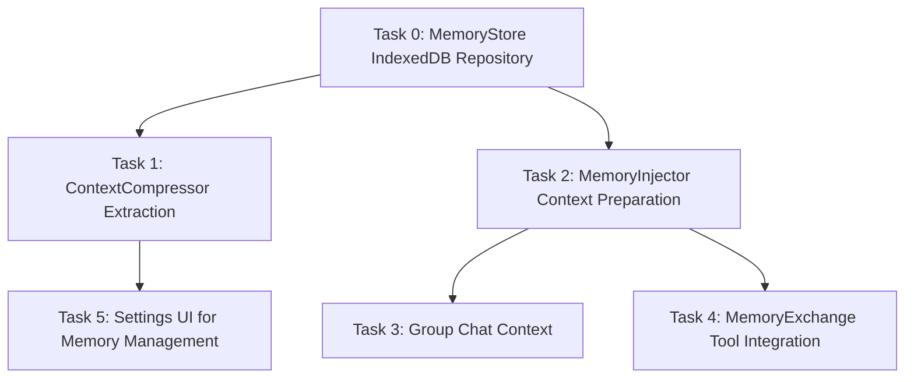

# 任务拆分 (Task Breakdown)：T12 AI Memory & Cognitive System

## 1. 拆分原则与依赖图
任务按模块分解，使得系统可以逐步实现并测试集成。我们将工作按领域层职责和基础设施层职责区分。复杂度控制在中等到低，每个任务都可独立验证其核心函数行为（部分通过单元测试验证）。

## 2. 原子任务清单 (TASK_T12.md)

### Task 0: 核心存储 `MemoryStore.js`
- **输入契约**：需要在 `src/core/memory/` 目录下完成 IndexedDB 操作工具封装。需要借用/模仿 `ImageStorageService` 异步机制，建立 `chat-buddy-memories` 库和 `memories` object-store。
- **输出契约**：提供 `saveFact(characterId, fact, importance, category)`, `getRelevantFacts(characterId, limit)`, `forgetFact(id)`, `applyDecay()` 等核心接口方法。
- **验收标准**：可以通过 console 手工调用或测试框架成功按 character 存储、查询记忆，更新最后回调时间。

### Task 1: 提炼与衰减 `ContextCompressor.js`
- **输入契约**：将现有的 `compressContext` 逻辑从 `chatService.js` 中抽离并更新所有引用。新增后台 LLM 请求方法 `extractMemoriesAsync` 以抽取总结为有价值信息的 JSON。
- **输出契约**：向外暴露核心压缩接口，并实现在旧消息被裁剪时非阻塞调用 `MemoryStore.saveFact`。
- **验收标准**：当聊天消息超载触发压缩后，IndexedDB 会在后台新增相应的持久化 fact，用户的前端体验不被阻塞。

### Task 2: 记忆注入 `MemoryInjector.js` & `AIPipeline.js` 修改
- **输入契约**：在 `AIPipeline.js` `_generateSystemPrompt` 的拼装阶段引用。
- **实现约束**：拉取该角色未衰减（非 `isForgotten`）的最重要或最近关联的记忆（暂定 Top 10 Facts）。把它们转换为简短的项目符号附着在由于个性化生成的 System prompt 内。被拉取的事实自动更新 `lastRecalledAt`。
- **验收标准**：大模型可以通过观察之前的对话得知用户几周前说的偏好和生活锁事（从 IndexedDB 拉取的）。

### Task 3: 群聊上下文复用
- **实现约束**：在组装 Context 前，查询 `StorageService` 或 `useChatStorage` 获取该用户最近的涉及多个人的群聊摘要。如果有，作为 Context 的一项注入（"Recent Group Chat summary: ..."）。
- **验收标准**：私聊时提问群中其他人的话，或者自己说的话，能得到 AI 相结合的回答。

### Task 4: 记忆交互工具 `MemoryExchange.js`
- **输入契约**：在 `AIPipeline.js` 和 `toolService.js` 的 `executeTool` 中增加解析支持。
- **实现约束**：指令为 `[MEMORY_REQUEST: target=characterName, topic=topicString]`。后台调用目标角色自身的 AI 模型与它的 `MemoryInjector` 数据回应请求者。
- **验收标准**：请求能在工具拦截后引发后台静默的多 AI 模型互动流，并带回另一角色的记忆内容或反馈。

### Task 5: UI & 设置界面支持 (Settings > Memory)
- **输入契约**：已有的 `Chat Buddy` 整个角色配置及界面组件。
- **实现约束**：在对应角色的设置页面（或单独面板）能加载并列出所有 Memory Facts（按时间/权重排列）。提供删除按钮清理记忆。
- **验收标准**：用户可以通过 UI 确认 AI 记住了什么，并且可以清理不想要的记忆。
