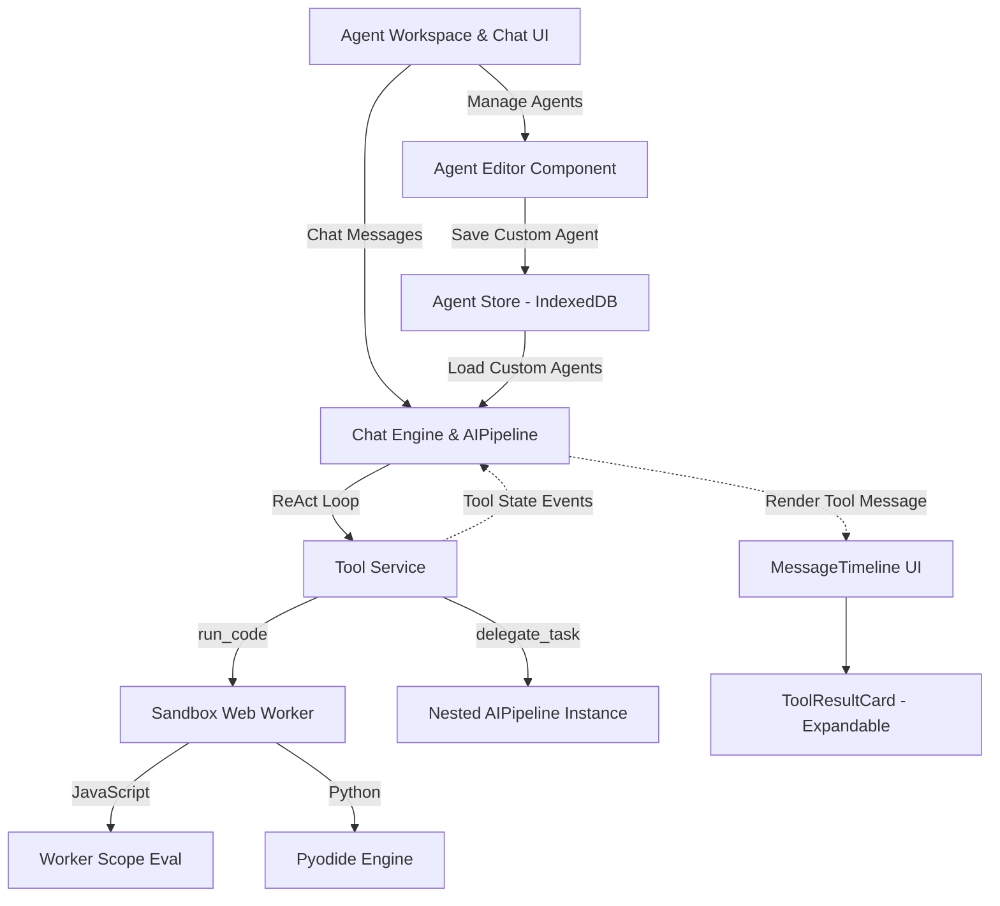

# T13: AI Agent & Tool System - Design

## 1. 整体架构图


## 2. 分层设计和核心组件

**表现层（UI）**
- **`AgentEditorModal.jsx` / `AgentForm.jsx`**: 构建高度可复用的智能体编辑表单。提供头像上传、名字、系统提示词输入及技能（Skills）选取等界面元素。在 `AgentWorkspace.jsx` 及其它未来新建角色入口皆可复用。
- **`MessageTimeline.jsx` (升级)**: 在聊天信息流内增加对全新类型消息 `msg.type === 'tool_event'` 或具备特定 tool payload 的普通消息的渲染支持。
- **`ToolResultCard.jsx`**: 一种具备 iOS 26 Liquid Glass 风格的可视化卡片。有三种主要状态（Loading, Success, Error），使用平滑展开动画。未展开时仅展示“工具名+极简摘要”，展开后展现比如搜索列表、代码运行结果等次级详情。

**执行引擎与核心数据编排（Core / Pipeline层）**
- **`AIPipeline.js` (扩展通信能力)**: 在 `_runReActLoop` 中执行工具前后触发特定回调，即 `callbacks.onToolStart(toolName, args)` 和 `callbacks.onToolEnd(toolName, result, error)`，使其能把状态推回聊天历史数组，前端从而获知“现在正在搜索”、“现在正在写代码”。
- **`toolService.js` (增加新能力)**:
  - 接管并重写 `run_code`：不再主线程直接执行，而是包装一层与 `SandboxWorker` 通信的 Promise。
  - 新增 `delegate_task`：允许主调入一个配置好的智能体 ID 及 Prompt 参数，其内部创建一个新的请求闭环返回给主智能体。

**底层执行与隔离层**
- **`SandboxWorker.js`**:
  - 创建无直接 DOM 操作权限的独立 Worker 线程。
  - 对于 JS 执行，构建隔离受限环境并拦截 `console.log` 实现 stdout 的捕获。
  - 对于 Python 执行，通过网络加载 `pyodide` WebAssembly 文件并初始化环境，支持基础 Python 验证。提供运行超时防御机制（超过 10s 即 terminate 原 Worker 派生新 Worker）。

**存储层**
- **`AgentStore.js`**: 基于应用现有的存储服务扩展出一个专属 `customAgents` 命名空间（IndexedDB）。

## 3. 接口契约定义

**工具状态消息推流通信格式 (用于渲染到会话流)**:
```json
{
  "id": "msg-tool-evt-xxx",
  "senderId": "agent-coder",
  "type": "tool_event",
  "toolName": "run_code",
  "status": "loading | success | error",
  "inputSummary": "Executing Python script...",
  "outputDetail": "[Code Output String] or JSON array",
  "timestamp": 123456789
}
```

**Sandbox Worker 通信 Payload**:
```json
// To Worker
{
  "type": "EXECUTE",
  "language": "python", // or "javascript"
  "code": "print('hello')",
  "timeout": 5000
}

// From Worker
{
  "type": "RESULT",
  "status": "success", // or "error"
  "output": "hello\n",
  "errorMsg": ""
}
```

## 4. 异常处理与性能策略
- **沙盒死循环与超时终止**：配置 `SandboxWorker` 以 Promise `race` 超时计时器形式运行；一旦超时（例如5-10秒），销毁并重注 `Worker` 对象，以防止恶意或错误代码死锁界面。
- **Pyodide 加载优化**：因 Pyodide (WASM) 首次加载耗时较长（10M+），不作为进入应用的依赖，仅在首次接收到 `python` 类型的 task 且尚未加载好的节点上触发惰性加载并通知 UI 展示 "Loading Environment..."。
- **协作无底洞拦截（委派死循环）**：在调用 `delegate_task` 的时候，需传递深度统计标记 `delegationDepth`。若超过预设深度（如 2），立即中断返回“无法委派：嵌套过深”，避免代理间无限套娃推托。
- **工具输出截断保底**：当 Worker 返还的代码或数据过大（例如直接 console 上万行），强制将其截断到特定字符数返回 LLM 和 UI，保证无崩溃和避免 Token 爆仓。
