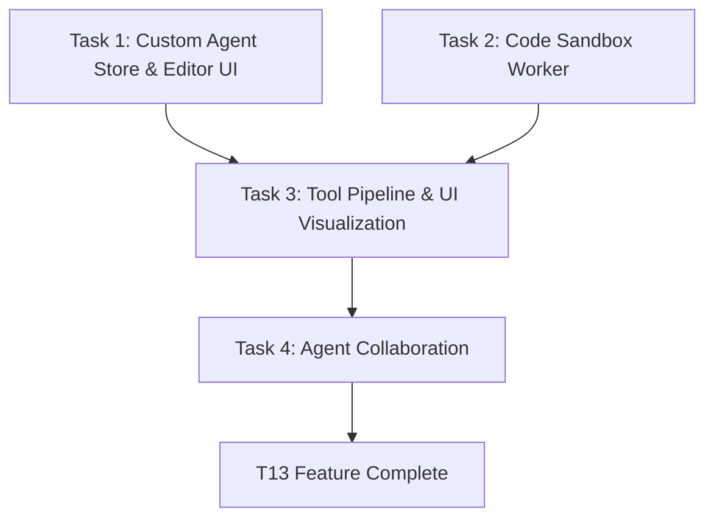

# T13: AI Agent & Tool System - Tasks (Atomize)

## 任务拆分总览

---

## 任务 1: Agent Store 与复用型编辑界面 (Custom Agents)
**目标**: 实现自定义 Agent 在 IndexedDB 中的增删查改，并在 `AgentWorkspace.jsx` 及侧边栏提供新建与管理的 UI 入口。

- **输入契约**: 现有的 `taskAgents.js`（预设智能体列表）、`StorageService` 或原生的 IndexedDB API 接口。
- **输出契约**: 
  1. `src/core/agents/AgentStore.js` (负责本地代理的 CRUD 持久化)。
  2. 整合后的数据结构：在获取当前 Agent 列表时，能够合并内置和自定义角色。
  3. `src/components/AgentEditorModal.jsx` (或 Drawer) 用于创建/编辑自定义代理（包含设置名字、系统提示、技能关联和头像上传）。
  4. 包含保存和删除功能，新增创建角色的“点击新建”入口被整合进 `AgentWorkspace.jsx`。
- **实现约束**: 编辑器 UI 必须独立分离且参数化，以便未来 T06 中的“普通朋友创建”复用相同底层；严格遵循 iOS 26 无边框、玻璃态设计语言。

---

## 任务 2: 代码沙盒隔离器 (Sandbox Worker)
**目标**: 为 JS 与 Python 的 `run_code` 执行行为构造 Web Worker 线程沙盒与超时检测，脱离应用主线程的直接运行。

- **输入契约**: 要执行的代码字符串，语言类型标识（`javascript` / `python`）。
- **输出契约**:
  1. `public/sandbox.worker.js` (或者配置为 Vite worker 处理的模块) 接收代码并执行。
  2. 实现对 `console.log` 标准输出流的捕获并传回主线程。
  3. 对于 Python，引入 CDN (如 jsdelivr 的 pyodide)，在第一次调用 python 执行时自动加载该环境并行执行。
  4. 支持超时强制销毁当前 Worker 实体。
- **验证手段**: 构造死循环测试；构造 python 计算代码执行验证；无响应代码 5s 后强制销毁并反馈 Error。

---

## 任务 3: Pipeline 通知推流与工具结果卡片可视化
**目标**: 扩充 `AIPipeline.js` 事件回调逻辑，注入 Tool Event 数据，并在 MessageTimeline 前台中美观渲染。

- **输入契约**: ReAct 执行中的 `[TOOL_CALL: run_code / search_docs]` 事件、Worker 成功或失败的反馈。
- **输出契约**:
  1. 在 `AIPipeline` 发起 Tool 调用前，给前台发送 `callbacks.onToolStart(toolName)`，让聊天记录插入（或临时插入）一条 `type: 'tool_event'` 且 `status: 'loading'` 的消息。
  2. 工具完成时触发 `callbacks.onToolEnd` 刷新对应临时消息为 `status: 'success'` 并存入其内容 `outputDetail`。
  3. `src/features/chat/components/ToolResultCard.jsx` 构建折叠卡片（加载态旋转图标、成功/失败标志）。能够基于 `toolName` 生成合理的概览（例如“正在执行 Python 环境...”或“搜寻 Perplexity: 查询”）。
- **实现约束**: 不能影响正常的文本 Message 的 `id` 流；截断大文本：`outputDetail` 大于 500 个字符强制渲染为 “[内容过长已折叠…]”。

---

## 任务 4: Agent Collaboration (`delegate_task`)
**目标**: 支持核心智能体自主判断分配次级任务，通过 `delegate_task` 函数启动另一个 Agent 的 LLM。

- **输入契约**: `[TOOL_CALL: delegate_task {"agentId": "agent-coder", "prompt": "..."}]` 工具调用，接收方角色 ID。
- **输出契约**:
  1. `toolService.js` 中新增实现 `executeDelegateTask`。
  2. 在新闭环中创建一条独立临时的系统角色+参数输入发往 `callAI` 或临时 Pipeline 进行结果提取。
  3. 返回给当前角色的回答结果作为最终 TOOL_RESULT。
  4. 嵌套调用深度追踪，大于一层级接连委派报错中断（防死循环套娃）。
- **实现约束**: 被委派的 Agent 执行不需要显示给 UI 所有底层对话栈，只要作为当前总管 Agent 的一次 Tool Card 记载（“已向 Coder 求助...”）。
