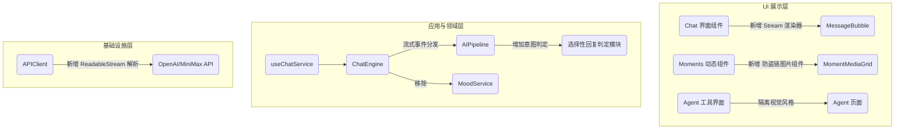

# 架构设计: UI_UX_Optimization_v0_5

## 1. 整体架构调整

基于现有的 Clean Architecture，我们将在以下层面进行架构调整：

## 2. 核心模块设计与接口契约

### 2.1 CSS 变量重构体系 (马卡龙橘色系统)
在 `src/index.css` 进行以下重构：
- `var(--color-primary)` 更新为 `hsl(28, 90%, 65%)` (马卡龙橘色)
- 设计暗黑模式映射：主背景采用温暖的深黑色（OLED/深棕黑），保持高对比度，确保文本达到 WCAG AA 级别标准。
- 对所有非法硬编码颜色（如 `#xxxxxx` 和 Tailwind `text-gray-900` 强绑定）进行变量化替换。

### 2.2 ChatEngine 状态机升级 (流式与实时性保障)
当前 `ChatEngine.js` 缺少流式支持且乐观更新可能有 bug。
- **接口新增**:
  - `_handleAIStreamStart(chatId, aiId, messageId)`
  - `_handleAIStreamChunk(chatId, messageId, chunk)`
  - `_handleAIStreamEnd(chatId, messageId)`
- **实时更新机制**: 
  - `sendMessage` 时，同步向 `this.chats` 压入消息对象，并立即触发 `this._notify()`。保证发送即上屏。
  - 订阅层 `useChatService` 必须使用 React 的准确订阅，防止不必要的深比较导致的丢帧。

### 2.3 AIPipeline 选择性回复机制
打破 `Math.random() > 0.3` 的简单机制。
- **判定逻辑**: 
  - 对于单聊：用户短句（如“哈哈”、“嗯”连续出现）降低回复概率或使用简短回复；用户提问则 100% 回复。
  - 引入 `LLM 意图路由` 或前端规则树进行“是否回复”判定。

### 2.4 Agent 属性净化
- 删除 `ChatEngine.js` 中的 `getMoodMap` 及关联调用。
- 删除 UI 组件中任何显示“好感度”、“心情”的徽章和入口。

### 2.5 朋友圈 (Moments) 稳健加载方案
- **逻辑**: 修改 `MomentMediaGrid`，引入前端 Image Proxy URL 转换。例如使用 `images.weserv.nl/?url=xxx` 进行反向代理获取，绕过某些图床的防盗链。
- **UI**: 提供基于 `lucide-react` 的 Loading 动画骨架屏，而非直接失败。

## 3. 异常处理策略
- API 请求流式传输失败降级：捕获 Stream 异常，降级回退到全量获取（即原逻辑）。
- 兜底机制：朋友圈图片经过代理仍失败后，再 fallback 到现有的文字卡片，最大限度挽救视觉体验。
