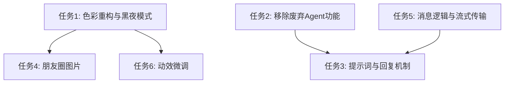

# 任务拆分: UI_UX_Optimization_v0_5

## 原子任务列表

### 任务 1: 色彩体系重构与黑夜模式修复 (Styling)
- **输入**: `src/index.css` 及所有包含硬编码色值的 UI 组件 (如 `MomentsPage`, `AgentCard`)
- **动作**: 
  1. 重写 CSS 变量，主色调改为马卡龙橘色 `hsl(28, 90%, 65%)`，调整 Dark Mode 配色以适应高对比度。
  2. 修复文本在黑夜模式下看不清的问题（解决 `text-gray-900` 造成的错误显示）。
  3. 修改黑体字体应用场景，避免在暗色模式下发糊。
- **输出**: 更新后的 `src/index.css` 及时应用所有界面的视觉刷新。

### 任务 2: 移除废弃的 Agent 功能 (Refactoring)
- **输入**: `src/core/chat/ChatEngine.js`, `src/features/chat/components/` 下的相关头衔、好感度、心情组件。
- **动作**:
  1. 删除 `MoodService` 相关逻辑，净化 `ChatEngine` 的 State。
  2. 清理界面上好感度和心情徽章的渲染。
- **输出**: 更纯粹的工具化 Agent 页面与干净的底层代码。

### 任务 3: 优化 Agent 提示词与回复机制 (Logic)
- **输入**: `src/data/personas.js` 或类似位置的系统提示词配置，`ChatEngine.js` 触发逻辑。
- **动作**:
  1. 优化所有系统角色的 Prompt，使“初音未来”等更符合人物设定。
  2. 实现选择性回复（智能判定是否触发回复），替代现在的随机/固定触发机制。
- **输出**: 更真实的聊天对话节奏。

### 任务 4: 朋友圈图片加载重构与优化 (UI & Logic)
- **输入**: `src/features/moments/components/MomentMediaGrid.jsx` 及 `momentsMediaService.js`
- **动作**: 
  1. 增加 Image Proxy（例如 weserv.nl）来跨域防盗链加载图片。
  2. 增加 Skeleton 骨架屏动画与 loading 状态。
- **输出**: 图片不再总是渲染 fallback，具有抗打击能力的图片墙。

### 任务 5: 消息收发核心逻辑修复与流式传输支持 (Core Engine)
- **输入**: `src/core/chat/ChatEngine.js`, `AIPipeline.js`, `useChatService.js`, `APIClient.js`
- **动作**:
  1. 解决刚发出的消息消失（确保 setState 与 storage 持久化的同步）。
  2. 实现对方状态指示器（正在输入、已读）。
  3. 修改 API 客户端与 Pipeline 支持流式分块渲染 (Stream Chunk)。
- **输出**: 实时无刷新的聊天体验，逐字打印效果。

### 任务 6: 动效与交互微调 (Animation)
- **输入**: 消息气泡组件、弹窗等 css/js。
- **动作**:
  1. 降低气泡弹出的 scale 或 translate 夸张程度。
  2. 统一其他动效。
- **输出**: 自然柔和的交互反馈。

## 任务依赖图

