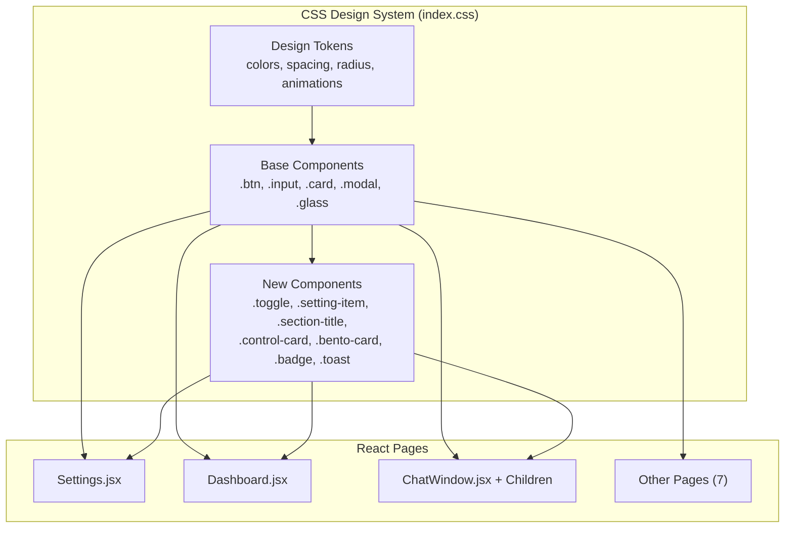
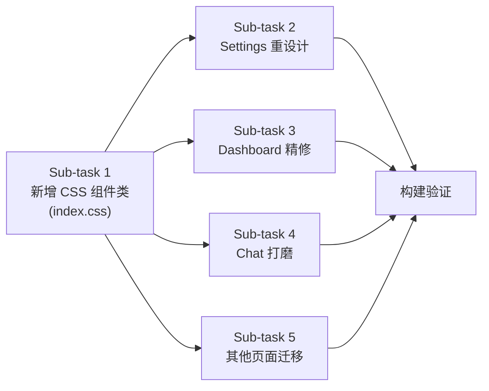

# DESIGN — T03 Phase 4 页面迁移 & UI 打磨

## 整体架构



## 核心组件设计

### 新增 CSS 组件类

| 类名                   | 用途               | 基础样式来源                |
| ---------------------- | ------------------ | --------------------------- |
| `.toggle`              | 切换开关           | 从 ControlCard 内联样式提取 |
| `.toggle.active`       | 开启状态           |                             |
| `.toggle-thumb`        | 切换滑块           |                             |
| `.setting-item`        | 设置列表行         | 从 SettingItem 内联样式提取 |
| `.section-title`       | 分区标题           | 从各页面重复样式提取        |
| `.control-card`        | 控制卡片           | 从 ControlCard 内联样式提取 |
| `.control-card.active` | 激活状态           |                             |
| `.bento-card`          | Dashboard 网格卡片 | 从 BentoCard 内联样式提取   |
| `.badge`               | 标签/徽章          | 新增                        |
| `.toast`               | Toast 通知         | 从 ChatWindow 内联样式提取  |
| `.page-container`      | 页面容器           | 统一页面的容器布局          |
| `.page-header`         | 页面标题区         | 统一页面的标题区布局        |

### 迁移策略

**保留 Tailwind**: 布局类 (`flex`, `grid`, `gap-*`, `w-*`, `h-*`, `p-*`, `m-*`)

**迁移到 CSS 类**: 外观类 (颜色、边框、圆角、阴影、背景、玻璃效果)

```diff
# Before (inline Tailwind)
- className="p-5 rounded-[var(--radius-xl)] border cursor-pointer bg-[var(--color-bg-white)] border-[var(--color-border-aurora)] shadow-md"

# After (CSS class + layout Tailwind)
+ className="control-card active p-5 cursor-pointer"
```

## 数据流向

无变化 — 本次修改仅涉及 UI 层样式，不影响数据流。

## 异常处理

- 暗色模式: 所有新 CSS 类均需提供 `.dark` 变体
- OLED 模式: 确保 `.dark.oled` 下颜色正确
- 动画强度: 新组件需兼容 `.anim-none` / `.anim-subtle` / `.anim-intense`
- `prefers-reduced-motion`: 新动画需在该媒体查询中禁用

## 任务依赖图


