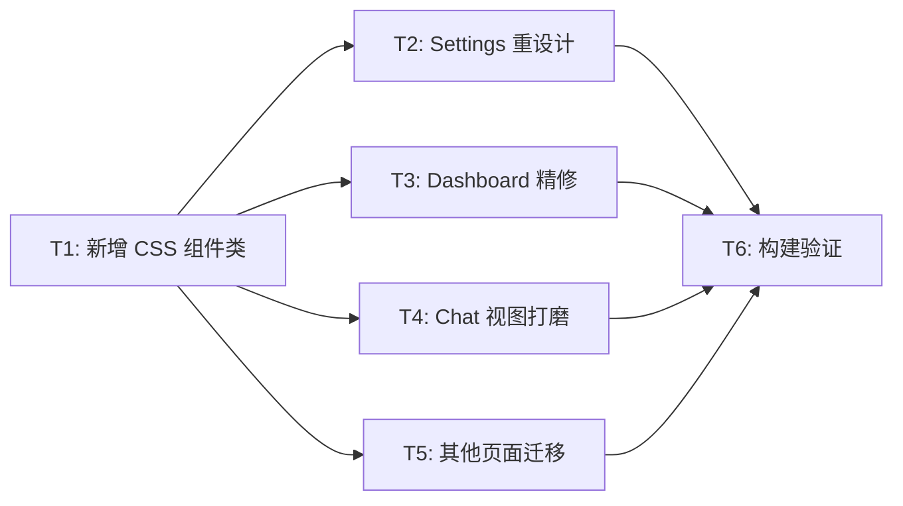

# TASK — T03 Phase 4 原子任务

## 任务依赖图

---

## T1: 新增 CSS 组件类 (index.css)

| 属性       | 值                            |
| ---------- | ----------------------------- |
| **优先级** | 最高 — 所有其他任务的前置依赖 |
| **复杂度** | 中                            |
| **文件**   | `src/index.css`               |

### 输入契约

- 现有 `index.css` 设计系统 (tokens, btn, input, card, modal, glass)
- 从 Settings.jsx / Dashboard.jsx 提取的内联样式模式

### 输出契约

新增 CSS 类: `.toggle`, `.toggle-thumb`, `.setting-item`, `.section-title`, `.control-card`, `.bento-card`, `.badge`, `.toast`, `.page-container`, `.page-header`

- 每个类均包含 `.dark` 变体
- 兼容动画强度系统

### 验收标准

- CSS 类可在组件中正确使用
- 暗色模式颜色切换正常
- 无 CSS 语法错误

---

## T2: Settings 页面重设计

| 属性         | 值                         |
| ------------ | -------------------------- |
| **前置依赖** | T1                         |
| **复杂度**   | 高 (392行, 内联样式最密集) |
| **文件**     | `src/pages/Settings.jsx`   |

### 输入契约

- T1 完成的 CSS 组件类
- 现有 Settings.jsx 的完整功能逻辑

### 输出契约

- 所有外观样式使用 CSS 类替代内联 Tailwind
- ControlCard → `.control-card` + `.toggle`
- SettingItem → `.setting-item`
- 分区标题 → `.section-title`
- 用户头像卡 → `.glass-crystal`

### 验收标准

- 功能不变
- 暗色模式正确
- 内联外观 Tailwind 类减少 80%+

---

## T3: Dashboard 精修

| 属性         | 值                                                        |
| ------------ | --------------------------------------------------------- |
| **前置依赖** | T1                                                        |
| **复杂度**   | 中                                                        |
| **文件**     | `src/pages/Dashboard.jsx`, `src/components/BentoGrid.jsx` |

### 输入契约

- T1 完成的 `.bento-card` CSS 类

### 输出契约

- BentoCard 使用 `.bento-card` 样式
- 统计组件使用设计 token
- 问候区使用 `.glass-crystal`

### 验收标准

- 卡片使用统一样式
- 响应式布局工作正常

---

## T4: Chat 视图打磨

| 属性         | 值                                                                            |
| ------------ | ----------------------------------------------------------------------------- |
| **前置依赖** | T1                                                                            |
| **复杂度**   | 中                                                                            |
| **文件**     | `ChatWindow.jsx`, `ChatHeader.jsx`, `ChatComposer.jsx`, `MessageTimeline.jsx` |

### 输入契约

- 现有 CSS 组件类 (btn, input, glass)

### 输出契约

- Header 使用 `.glass-strong`
- 输入框使用 `.input-modern`
- 发送按钮使用 `.btn-primary .btn-icon`
- Toast 使用 `.toast`

### 验收标准

- 聊天界面简洁
- 交互效果保持

---

## T5: 其他页面迁移

| 属性         | 值                                                                                 |
| ------------ | ---------------------------------------------------------------------------------- |
| **前置依赖** | T1                                                                                 |
| **复杂度**   | 中 (7个页面, 但模式一致)                                                           |
| **文件**     | About, Help, FriendsPage, AchievementsPage, AgentsPage, ProfileEditor, UserProfile |

### 输入契约

- T1 完成的 CSS 组件类

### 输出契约

- 按钮 → `.btn-*`
- 卡片 → `.card` / `.card-glass`
- 输入框 → `.input-*`
- 页面容器 → `.page-container`

### 验收标准

- 内联外观样式大幅减少
- 暗色模式正常

---

## T6: 构建验证

| 属性         | 值             |
| ------------ | -------------- |
| **前置依赖** | T2, T3, T4, T5 |
| **复杂度**   | 低             |

### 验收标准

- `npm run build` 成功, exit code 0
- 无新增 Warning
